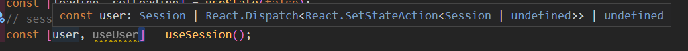

세션을 자주쓰게 될 것 같아서 모듈화 했다  
리덕스를 써서 관리하는 게 더 편하지만 ....

**return 할 때 객체로 담아야 타입이 안꼬인다**  
그리고 사용할 객체만 뽑을 수 있어서 좋다  
배열도 비워놓고 반점 치면 되긴 하지만 타입 꼬이는 건 조금 힘들다

그리고 타입스크립트를 위한 코드를 작성해야함 ex . `instanceof`

  
배열로 하면 잘 꼬이게 된다

```tsx
import { useState, useEffect } from 'react';
import { supabase } from '../supabaseClient';
import { AuthSession } from '@supabase/supabase-js';

const useSession = () => {
  const [user, setUser] = useState<AuthSession>();
  useEffect(() => {
    supabase.auth.getSession().then(({ data: { session } }) => {
      session && setUser(session);
    });

    const {
      data: { subscription },
    } = supabase.auth.onAuthStateChange((_event, session) => {
      session && setUser(session);
    });

    return () => subscription.unsubscribe();
  }, []);
  return { user, setUser };
};

export default useSession;
```
