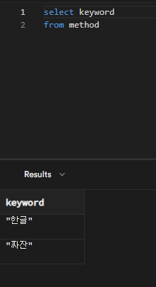
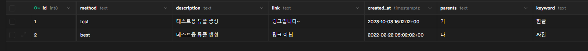

궁금한 것들

## 전체 출력하려하는데 자원 절약 팁이 있을까

sql 스니펫으로 작성해 놓은 것의 결과는 캐싱되어 자원이 절약되는가
뷰 테이블 같은걸로 만들어놔야 되나?
한줄로 쭉 뽑고 싶은데 어떻게 해야되지?

## 인덱스가 적용된걸까

인덱스에 적용하기 용이하게 id 를 int8 is Identity 설정해놨다
조건이 충족하긴 하지만
저 Identity 설정이 uuid 에도 되는 만큼 인덱스 부여가 따로 있을 가능성이 높다

## 인증 절차

authentication 에서 인증 절차가 나온다
인증 절차중에는 데이터에 소유자 데이터를 같이 넣고 인증하는 구조도 있었는데

- jwt 기반의 이메일을 통해 인증하는 구조
- 로그인 유저 아이디로 로그인 > 아마도 여러 플랫폼 로그인 고유번호를 포함하기 위함으로 추정됨
- 인증된 사용자... 뭘로 인증하는진 구체적으로 안나온 것으로 확인하는 방법 등이 있었다
- 모든 사람이 조회 가능한 것도 있었음
  [Use Supabase Auth with React | Supabase Docs](https://supabase.com/docs/guides/auth/quickstarts/react)

[hide-api-key-research](hide-api-key-research)
