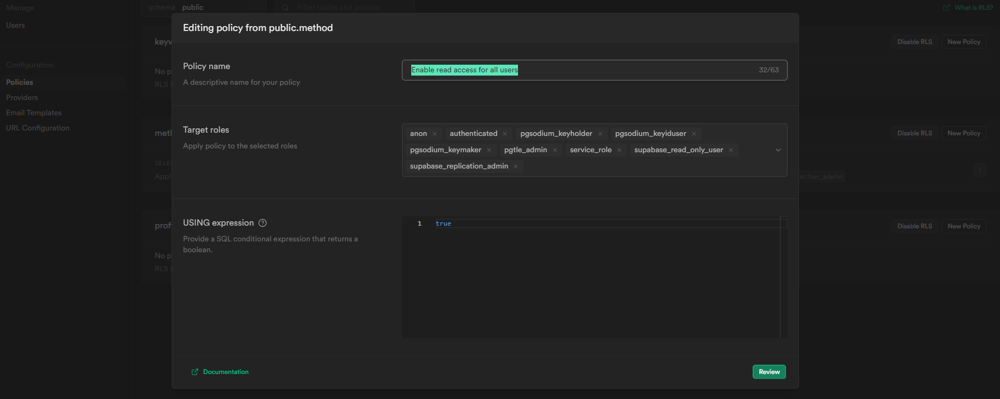
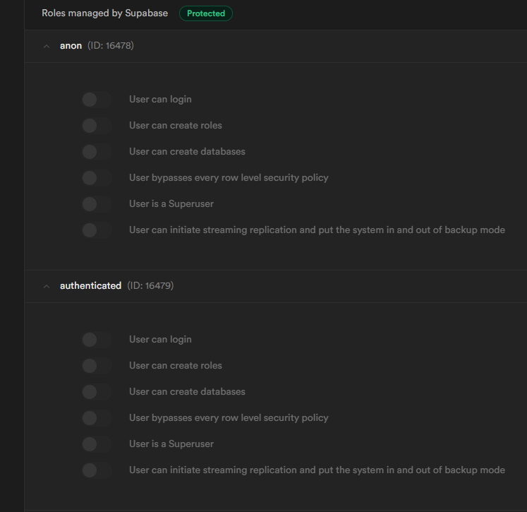
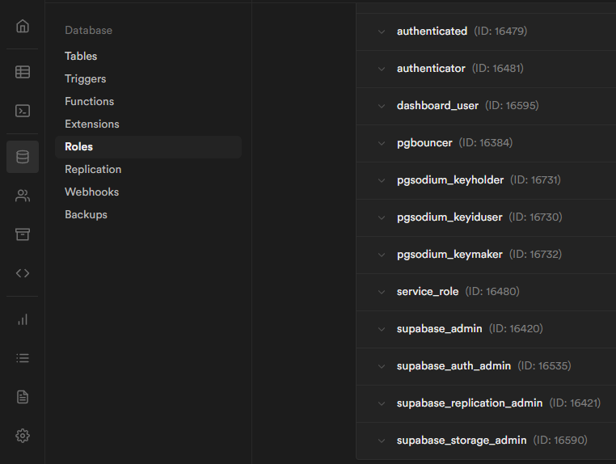
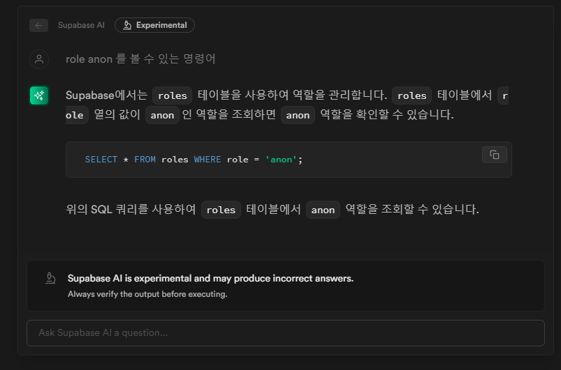
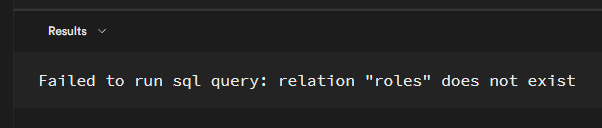
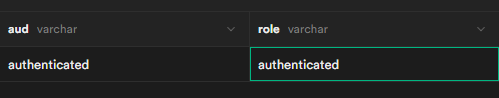
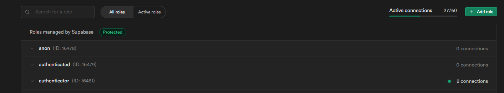
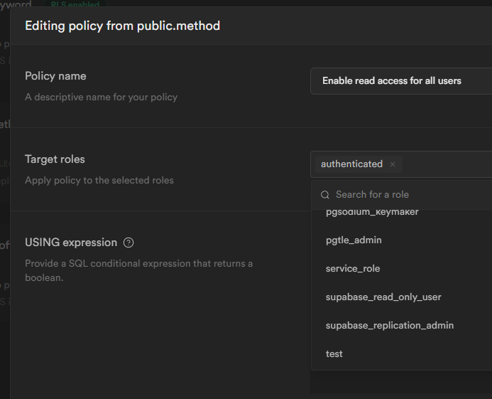

테이블에 대상별 정책을 설정할 수 있는데
이걸 정의해야 웹에서 데이터를 가져온다

그런데 뭐가 방문자고 뭐가 인증받은 사용자인지 어떻게 구분하는가
그걸 모르겠다
defaults to all public roles if none selected 이라고 한다
선택하지 않으면 모든 공개 역할 전체 선택이 기본 값이다

선택한 역할에 정책 적용 ....
위에 roles 에서 선택하는 것은 생성할 정책을 부여할 미리 선택된 roles 이다

roles 들은 정의될 때 로그인 가능 룰 생성 가능 등 같은 것들을 가져가는데
이건 데이터베이스 자체에 대한 관리 권한으로 보인다



그런데 이 권한은 데이터베이스에 대한 권한이다

여기서 말하는 대상의 정의가 뭔지 좀 찾아다녔다

일단 아래 정의된 것들은 Database-Roles 에서 볼 수 있다


anon : 익명 , 다이렉트 접속자
authenticated : 인증 받은 사람
pgsodium_keyholder :
pgsodium_keyiduser :
pgsodium_keymaker :
pgtle_admin :
service_role :
supabase_read_only_user :
supabase_replication_admin : ???

추정이 안된다 이건 부여하기에 따라서 알마든지 달라질 것으로 보인다

이런 권한 부여를 supa base 는 RLS 라고 정의하고 있다
[Row Level Security | Supabase Docs](https://supabase.com/docs/guides/auth/row-level-security)

작성되는 것은 이렇게 되어있다
아래 작성된 것을 보면 TO 에 roles 가 적혀져있다
유저가 안적혀잇다

해당 사항은 postgre 를 참고하면 도움이 된다
[PostgreSQL: Documentation: 12: CREATE POLICY](https://www.postgresql.org/docs/12/sql-createpolicy.html)

```sql
CREATE POLICY "Enable read access for all users" ON "public"."method"
AS PERMISSIVE FOR SELECT
TO anon, authenticated, pgsodium_keyholder, pgsodium_keyiduser, pgtle_admin, pgsodium_keymaker, service_role, supabase_read_only_user, supabase_replication_admin
USING (true)

```

하지만 여전히 TO 의 대상이 되는 anon 이 뭐하는 것들인지
role 은 역할인데 이 역할을 부여하는 방법은 없는 것인지

## 자동 생성 때문인가

supabase AI 로 만든 권한 부여 예제다
특정 대상을 선택해서 권한을 주고 있는데...

```sql
-- create a table to store user data
create table
  users (
    id integer primary key generated always as identity,
    name text not null,
    email text not null unique,
    password text not null
  );

-- enable row level security
alter table users enable row level security;

-- create a policy to allow specific users to select data
create policy "Allow specific users to select data" on users for
select
  using (auth.uid () in ('user1', 'user2'));

-- create a policy to allow specific users to insert data
create policy "Allow specific users to insert data" on users for insert
with
  check (auth.uid () in ('user1', 'user2'));

-- create a policy to allow specific users to update data
create policy "Allow specific users to update data" on users
for update
  using (auth.uid () in ('user1', 'user2'));

-- create a policy to allow specific users to delete data
create policy "Allow specific users to delete data" on users for delete using (auth.uid () in ('user1', 'user2'));

-- grant access to specific users
grant
select
,
  insert,
update,
delete on users to user1,
user2;

-- end of SQL query
```

## 유저의 역할 바꾸기로 유추하기

supa base search AI 한테 물어봤다
Is there a way to change user 's roles ?

```SQL
-- You can use the ALTER USER command to change a user's role
-- For example, to change the role of user 'johndoe' to 'admin':
alter user johndoe
with
  role admin;
```

일단 ROLE 이라는 단위가 있다
[PostgreSQL: Documentation: 12: CREATE ROLE](https://www.postgresql.org/docs/12/sql-createrole.html)

이 ROLE 은 유저에게 부여 되기도 하는 속성이다
ROLE 은 정말 다양한게 있지만 기본적으로 데이터베이스에 엑세스할 수 있는 권한을 부여받곤 한다
특정 조건에의해 자동으로 부여될 수도 있다
아무것도 설정하지 않으면 `PUBLIC` 으로 설정되고 그냥 공개 설정이 된다

## 소거법

전부 돌렸을 때 authenticated 에 인증이 됬다
내가 클라이언트에 설정한 것은 anon 키 인데 .. 왜 됬을까

일단 anon 가 일치하고 전송하는 주소가 일치한다 ( 설정으로 맞춤 )
그럼 vite port 번호가 다르다면?
anon 는 충족하지만 authenticated 는 아니게 된다

결론 : 포트가 일치하고 anon 도 일치하는 것은 교집합이지만 역할은 하나만 부여된다

> 원하는 보안설정을 하고 싶으면 authenticated 만 하면 된다 : 주소와 api 가 일치해야한다

이걸 최소 조건으로 잡아두면 도메인을 털어야 인증을 받을 수 있다

```tsx
CREATE POLICY "Enable read access for all users" ON "public"."method"
AS PERMISSIVE FOR SELECT
TO authenticated
USING (true)

```

## 공식 문서 읽기

그냥 공식문서 열심히 읽었다
role 은 policy 로 된 요소를 가지고 있다
그래서 어딘가에 policy 의 정의를 관리하고 있을 것이라는 생각을 했다
일단 한글 질문이 된다는 것은 좋았다
하지만 이 코드는 실행되지 않는 코드였다 이 AI 는 GPT 인 것 같다



### Roles

일단 유저의 role 은 수정할 수 있다
supabase 에서 관리되는 auth 테이블 중에서 존재를 확인했고 수정도 가능할 것으로 보여진다


그런데
supa base 에서 관리하는 것 중
authenticated 는 선택이 되고
authenticator 는 선택이 안되는데 활성화는 authenticator 에만 되어있다
그런데 위에서 선택은 authenticated 를 해야 로컬 환경에서 테스트가 가능했다


테스트로 roles 를 추가할 수 있었고
Other database roles 에서 이걸 확인 할 수 있었다
즉 정책을 정의하고 정책의 roles 을 정하는 것까지를 모듈화할 수 있다

이제 user 에게 권한을 주는 방법만 찾으면 된다
다른 Roles 가 부여되는 조건들을 찾으면 된다
또는 권한이 부여되는 방법을 찾아야한다


공식문서에서 더 이상 방법을 찾기 어려웠다
커뮤니티를 이용하기로 했다
[discord](../discord/discord)
