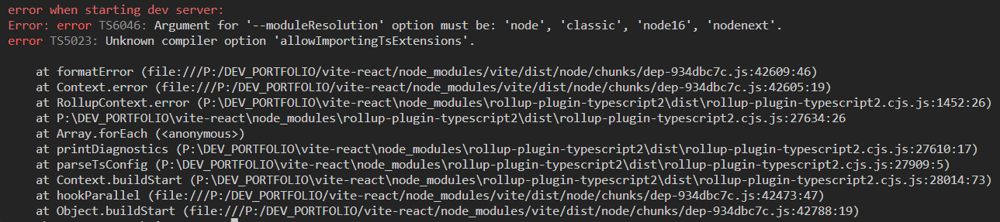
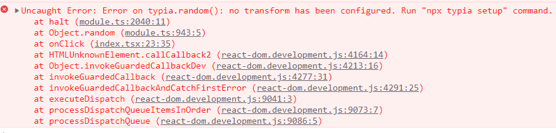

객체 유효성 검사 , 자동 타입 생성 , 타입에 맞는 더미 데이터를 생성하는 기능
typia 는 타입스크립트 라이브러리

미리 선언한 인터페이스에서
인터페이스 안에 작성한 주석으로 유효성검사도 되기 때문에 직관적이다

[GitHub - samchon/typia: Super-fast Runtime validator (type checker) with only one line](https://github.com/samchon/typia)
[Typia Guide Documents - Index](https://typia.io/docs/)

## 랜덤 생성기

객체를 미리 선언한 인터페이스에 맞게 생성해준다
인터페이스 안에 작성한 주석으로 유효성검사도 되기 때문에 직관적이다

생성 형식은 주석을 통해 선언한다

선언 할 수 있는 댓글 태그 종류는 아래 링크로 확인
[Typia Guide Documents - Random](https://typia.io/docs/random/#comment-tags)

## settings

```
npm create vite@latest vite-react -- --template react-ts
cd vite-react
npm install
npm i -d typescript@4.9.5
npm i typia
npx typia setup
npm i -d rollup-plugin-typescript2
```

vite.config.ts > [vite config](https://typia.io/docs/setup/#vite)

했는데 에러 발생

안하면 이 에러가 떠서 걷어내기로 했다

