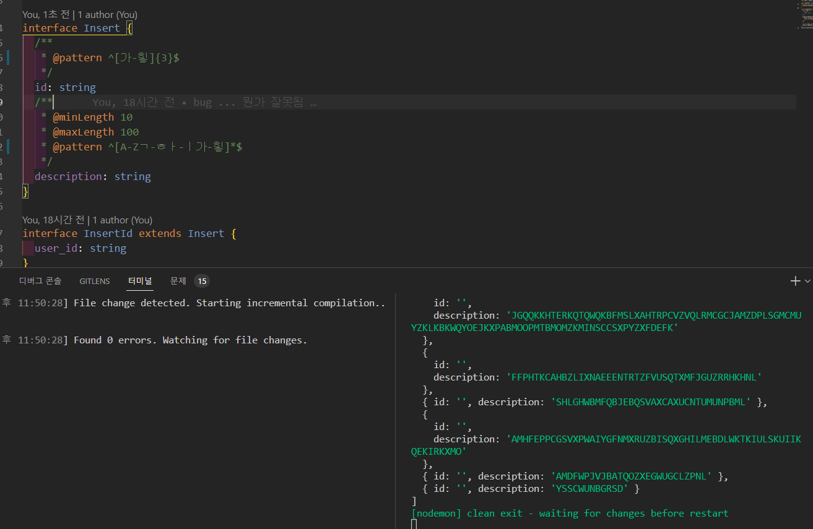
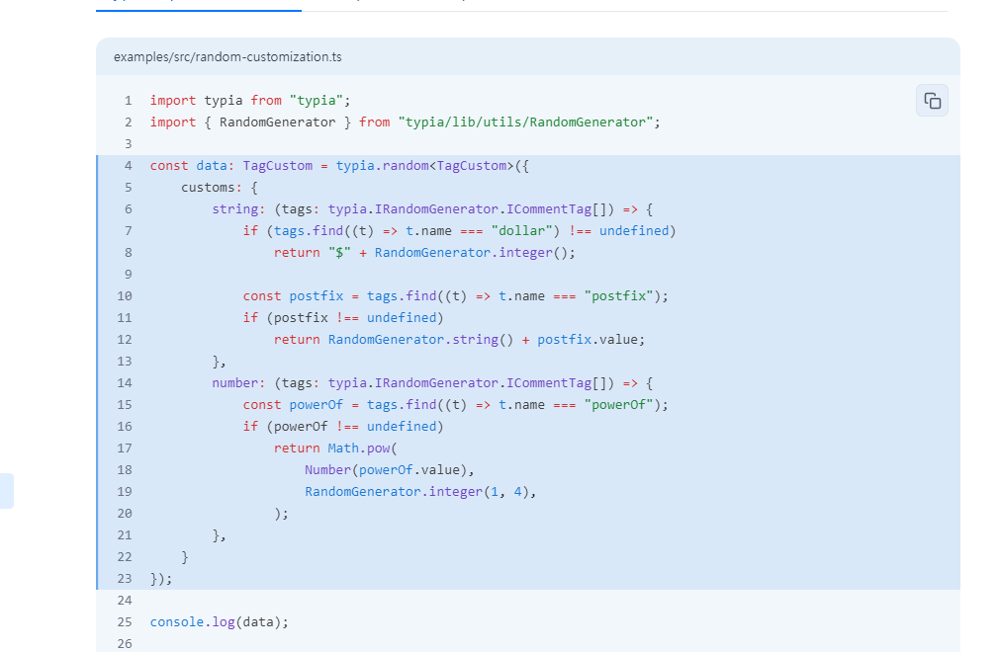

```
npm init -y
npm i typescript@4.9.5
npm i typia
npx typia setup
npm i dotenv
npm i -D tslib @types/node
```

```json
{
  "compilerOptions": {
    "target": "ES2015",
    "preserveValueImports": false,
    "module": "CommonJS",
    "moduleResolution": "node",
    "lib": ["ESNEXT", "DOM"],
    "esModuleInterop": true,
    "isolatedModules": true,
    "strict": true
  },
  "include": ["src/**/*.ts"],
  "exclude": ["node_modules"],
  "plugins": [
    {
      "transform": "typia/lib/transform"
    }
  ],
  "ts-node": {
    "esm": true
  },
  "strictNullChecks": true
}
```

[ts-node 로 TypeScript (\*.ts)파일 실행하기 Unknown file extension ".ts"](https://supern0va.tistory.com/18)
[ts-node - npm](https://www.npmjs.com/package/ts-node)

## 위에는 실패했지만 다른 분의 코드를 보고 성공했다

누가 같은 라이브러리 쓰는 것을 봤는데
저장소를 보여주셔서 `hardcarryDev/toy_project_api`

도움을 받아서 성공할 수 있었다

기존 내 코드의 문제는 tsc 를 제대로 쓸 줄 몰랐다는 것이였다
생략된 import 는 .ts 와 .js 를 구분하지 못하거나 ts 를 인식했다

그래서 아래 두가지 에러가 나왔던 것이였다
TypeError (ERR_UNKNOWN_FILE_EXTENSION): Unknown file extension ".ts"

- 이 에러는 .ts 를 읽어서 나오는 에러였다
  ReferenceError: exports is not defined in ES module scope
- 이 에러는 package 에 `"type": "module"` 을 쓰거나 지우면 나오는 것이였다

tsconfig 에   `"outDir": "./build",` 를 추가하고
스크립트를 변경해서 성공했다

```json
    "dev": "nodemon ./build/index.js --mode development",
    "update-types": "npx supabase gen types typescript --project-id \"dblntvvagfqxjblwlfxt\" > src/types/supabase.ts",
    "prepare": "ts-patch install",
    "build": "rmdir /s build && tsc -w"
```

리눅스 또는 맥북을 쓰셨는지 원본 스크립트는 `"build": "rm -rf ./build && tsc -w",` 였다

하지만 한글 생성이 안되서 존버하기로 했다


커스텀을 제안 받았지만
정규식으로 어떻게 만드는지 몰라서 .. 공부할 게 늘었따

어..... 정규식으로 랜덤 생성해주는 코드는 아직 안해봣는데 ㅠ...... 근데 저 코드에서 postfix 는 어디서 쓰는거고.. tags.find 가 무엇을 반환하길래 postfix.value 가 있는지 같은게 조금 딥하다

## 정규식기반으로 랜덤 값 뽑는 코드

0x 는 hex 값 표현식이다

```tsx
function generateRandomKorean(len: number) {
  const koreans = [];
  for (let i = 0; i < len; i++) {
    const str = String.fromCharCode(
      Math.floor(Math.random() * (0xd7a3 - 0xac00)) + 0xac00
    );
    koreans.push(str);
  }
  return koreans.join('');
}
```
