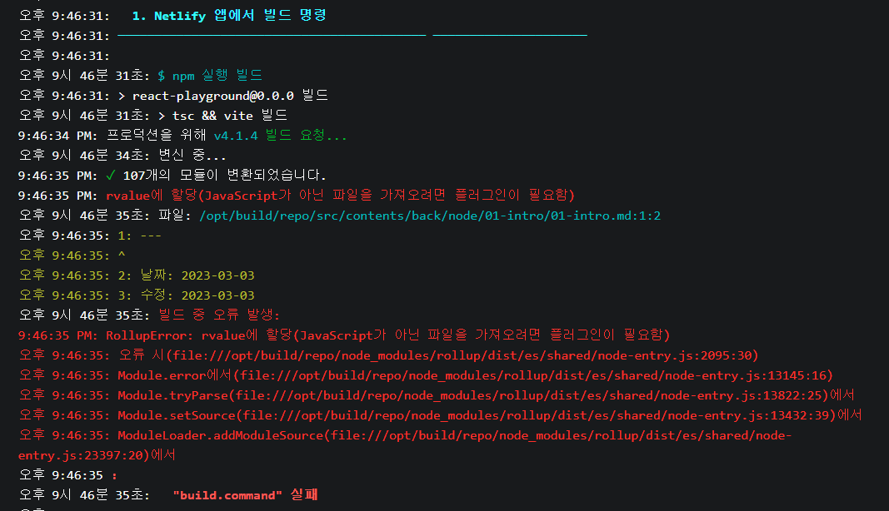

열심히 glob 로 만들어놨더니
플러그인이 있다고 한다
[GitHub - hannoeru/vite-plugin-pages: File system based route generator for ⚡️Vite](https://github.com/hannoeru/vite-plugin-pages)

플러그인들은 [플러그인 API | Vite](https://vitejs-kr.github.io/guide/api-plugin.html)
이 경로에서 볼 수 있따

왜 찾게 됬냐면 빌드 과정에서 파일을 가져오는게 안되서 찾게 되었음

로컬에서도 안되더라
그래서 플러그인을 찾게 됬는데
[GitHub - y-nk/vite-plugin-remark-rehype: a vite plugin to setup remark/rehype pipeline](https://github.com/y-nk/vite-plugin-remark-rehype)

npm 도 잘 안만들어놔서 깜짝 놀랐다
있긴 있다\
[vite-plugin-remark-rehype - npm](https://www.npmjs.com/package/vite-plugin-remark-rehype)