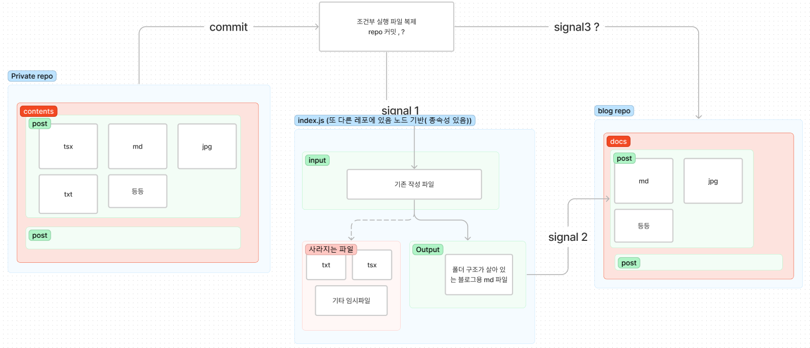

내 목적은 홈페이지 배포 과정에서 쓰이는 파일 안에 같이 들어있는 md 파일들만 추출해서
docusaurus 를 통해 github blog 에 배포하는것이다

그래서 방식을 생각해봤다

- 로컬환경에서 자동으로 특정 깃의 파일을 업데이트 받고 싶은 상황
- git hooks 는 hub 플랫폼에서 되는거지 로컬에서 안되는 걸로 알고 있는데 > husky 로 어떻게 되지 않을까
  - 아니면 git 이 실행시켜주진 않을까
- git hub 에서 만들고 받아오는 방식으로 구축하면 될 것 같긴 한데
- 특정 확장자만 받아오는 로직을 어디서 작성해야하는지 잘 모르겠다



CICD 구축하고 싶은데 .. 특정 코드를 실행시키고 파일을 옮기고 하는 걸 다 분리된 레포에서 하려하는게 약간 막힌다
정보가 필요하다

일단 signal 1 에 해당하는 파일 중 특정 파일을 삭제하는 것에 대해선 아주 잘 된다

프라이빗 레포에서 signal 1 을 보낼 레포로 파일을 어떻게 옮길거고
이렇게 출력되어 나온 output 을 blog repo 로 전달하는 게 어떻게 하는 건지 모르겠다

## 질답하기

질문 하던 중
더들을 어떻게 경유 시켜야하는지 마땅한 방법이 떠오르지 않네요 그나마 괜찮은 방법은 중간 경유하는 index.js 를 패키지 모듈로 만들어서 실행시키는?? 건 어떨까요 같은 질문에서
시도할만하다는 각이 섯다
프라이빗레포 어케 끌어올지 찾아와야겠다는 생각

지금 하고 있는건 폴리 레포 제어라고 한다
모노레포를 하면 어떻냐는 것에 통합을 고려해봣다
index.js 에 필요한 것을 도큐사우르스에 같이 설치하고
떠올랐다

상위 레포가 참조중인 레포가 항상 자동으로 최신참조로 업데이트 되는게 아니라서 매 업데이트마다 반복해줘야하는 불편함이 있는데

> 이건 한번에 작업되도록 하려고 한다

## 결론

1. 액션 워크플로우를 실행시키기 위해서는 무언가 트리거가 필요
2. 같은 경로의 폴더 하위에 레포를 두고 제어해보자

Private Repo 쪽 액션에서는 " 특정 경로의 파일이 변경되고 메인브랜치에 푸시된 " 조건으로 트리거되는 워크플로우를 만드세요

## runs-on: ubuntu-latest 이 무엇인가

깃 액션의 실행환경이다
[GitHub Actions: Ubuntu-latest workflows will use Ubuntu-22.04 | GitHub Changelog](https://github.blog/changelog/2022-11-09-github-actions-ubuntu-latest-workflows-will-use-ubuntu-22-04/)
을 보고 유추할 수 있다

## 구조 변경

상위 요소가 하위요소에서 스크립트를 실행할 수 있는지 찾아보고자 했고
--prefix 의 존재를 알게 되었다
[[DOCS] \`--prefix\` not documented for \`npm run\`, \`npm install\`, etc. · Issue #1368 · npm/cli · GitHub](https://github.com/npm/cli/issues/1368)

> [!NOTE] Bing
> `npm i` 명령어를 실행할 때 `--prefix` 옵션을 사용하여 하위 폴더의 경로를 지정해주면 됩니다.
> 예를 들어 `npm i --prefix ./my-subfolder` 와 같이 사용할 수 있습니다. 이렇게 하면 `my-subfolder` 폴더 내에서 `npm i` 명령어가 실행

가져오는 구조는 아래 방식을 사용해서 불러오기로 함

```shell
git clone {repo link} {Folder name}
```

my blog 에서는
`git clone https://github.com/mineclover/ObsidianMarkdown-to-docusaurus.git macro`
를 쓰는 스크립트를 넣어서 필요한 폴더를 만들고
위에서 prefix 써서 pull 받아오도록 구성할 것임

이런식으로 쭉 내려가게끔
`"sync": "git pull && npm run sync --prefix ./macro"`
