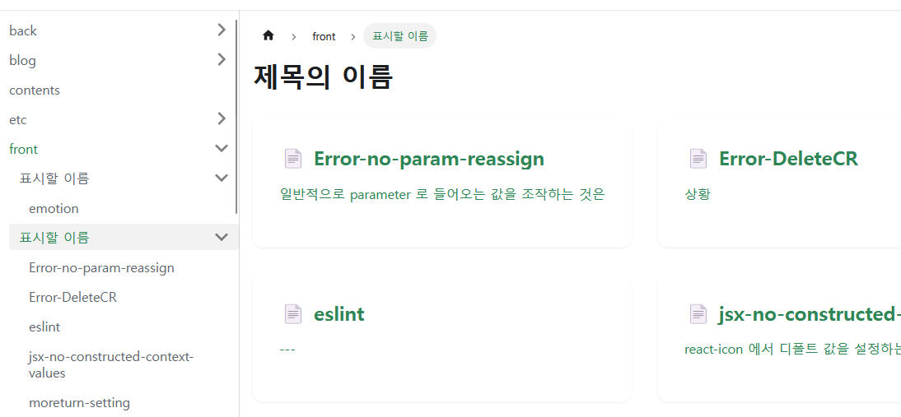
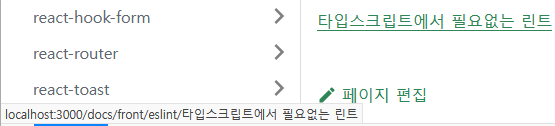

## 마크다운 경로에서 .md 가 안사라져서 URL 오류가 나던 문제

`[WARNING] Blog markdown link couldn't be resolved:~~~` 이라는 오류가 뜨는 것이 .md 가 안되었다라는 것을 의미하는데
이 프로세스가 해당하는 프로세스 뿐 만 아니라 정상적으로 작성한 다른 프로세스에도 영향을 미치는 것으로 추정된다

> 이 문제의 증상은 링크에 .md 가 붙어서 경로가 깨진다

경로가 유실되면 오류가 발생한다
md 파일 내에 외부 링크도 좀 있는데 .... 어떻게 될지 체크를 해봐야할 것 같다

## 폴더 링크와 내부 폴더간 링크 문제

파일 구조적으로는 A 안에 A B C 가 있으면 A B C 는 같은 깊이를 가지지만
도큐사우르스에서는 A 는 A 와 같은 깊이를 가지고 B C 가 A 옆에 있기 때문에 B C 도 같은 높이를 가진다
[T2023-03-30 | 개발 정보 모음](https://mineclover.github.io/docs/topic/tech-review/T2023-03-30) 이쪽 글을 보면 같은 경로 내에 있는 파일을 가르키고 있는 링크가 깨진 것을 볼 수 있다

이는 같은 이름의 폴더나 index.md 로 된 폴더는 그 폴더의 메인 컨텐츠로 간주하는 것 같다
[자동 생성 | Docusaurus](https://docusaurus.io/ko/docs/sidebar/autogenerated#category-item-metadata)
그래서 해결 방법은 두가지다

- 하나는 링크를 하지 않는 것
- 다른 하나는 다른 글들도 폴더로 감싸는 것이다

폴더파일 > 하위 파일 방향의 링크 또는 하위 파일 > 폴더 파일 링크

## 링크 간소화 개념 문제

모든 마크다운은 기본적으로
docs 폴더 기준으로 최소
3 단계는 들어가야된다

대분류/소분류/주제/정보
순서인 것이다

그렇게 들어온 md 파일들은 확장자와 이름을 포함해서 링크에서 생략된다
즉 자신의 폴더가 있어야 고유한 이름의 바로가기 사용이 가능하고
그렇지 않은 경우 경로가 깨진다
이건 위에서의 폴더 링크와 내부 폴더간 링크 문제와도 동일한 문제의 구조를 가지고 있다


특이한 버그가 있었는데
git-commend 제목의 md 파일의 경우 링크가 아예 git 이 되버려서 혼선이 있었다
아무튼 지금 문제가

1. 정상 경로는 대주제 > 소주제 > 내용폴더 > 내용.md
2. 내용과 내용폴더의 이름이 같은 것은 도큐사우르스가 통합한다 > 링크 생성 `대주제/소주제/내용폴더`
   1. git-commend 는 vite 블로그 쪽에서 git 으로 축약되어 문제를 겪고 있다 [git-commend](../../../work/git/git-commend)
   2. 이건 폴더 안에 경로를 넣지 않아서 생기는 문제인데 vite 블로그에서는 정확한 파일이 아니라 해당 포스팅이 있는 카테고리로 보내기 위해 기획되었기 때문이다
   3. 그래서  위는 되고 아래는 안된다
   4. 해결하는 방법은 경로와 파일명이 같으면 기존 형태로 , 경로와 파일명이 다르면 새로운 형태로 바꾸거나
   5. 해당 경로를 활성화 시키면 된다 > 이 방법은 그 폴더에 `_category_.json` 같은 것을 생성하는 것

### 설정으로 완성도 높이기

이건 자동생성에 관련한 문제였다
[자동 생성 | Docusaurus](https://docusaurus.io/ko/docs/sidebar/autogenerated#category-item-metadata)

기본 설정으로 보여주는 index 설정 기준 객체다
요약하자면 index , readme , 경로와 똑같은 파일이름
이 3 가지 조건을 충족하는 파일이 있으면 true 로 간주한다

```js
function isCategoryIndex({ fileName, directories }) {
  const eligibleDocIndexNames = [
    'index',
    'readme',
    directories[0].toLowerCase(),
  ];
  return eligibleDocIndexNames.includes(fileName.toLowerCase());
}
```

해당 설정을 적용하려고 공식문서를 뒤젹여봤으나 성과를 보진 못했다

### `_category_` 문서 만들기

그래서 `_category_` 파일을 넣어서 제어하기로 하엿음
[자동 생성 | Docusaurus](https://docusaurus.io/ko/docs/sidebar/autogenerated#category-item-metadata)

```yaml
position: 2.5 # float position is supported
label: 'Tutorial'
collapsible: true # make the category collapsible
collapsed: false # keep the category open by default
className: red
link:
  type: generated-index
  title: Tutorial overview
customProps:
  description: This description can be used in the swizzled DocCard
```

```yaml _category_.yml
position: 1 # 사이드바 순서
label: '표시할 이름'
collapsible: true # 접을 수 있는지
collapsed: false # 초기에 얼려있도록 할 것인지
className: red
link:
  type: generated-index
  title: 제목의 이름
customProps:
  description: 설명문
```

현재 클래스 네임 항목이 조금 애매하다
저 항목이 class red 를 부여한다고는 적혀있으나 실제 적용된 페이지에서 red 라는 것은 선언되어있지 않았다
현재 도큐사우르스에 css 를 적용하는 방법을 찾지 못했기 때문에 추가 설정은 생략하고 그대로 사용하기로 했다


#### 테스트해본 결과 해결이 된다

이렇게 카테고리를 부여할 경우
자기 자신에게 있는 파일의 경우에도 상대경로 기반의 경로 설정이 부여되면서
기존에 있던 문제 중 하나가 해결이 됬다

이제 로직에 폴더별로 카테고리를 만드는 구조를 만들 것이다


## 한글 경로 에러

파일명이 한글일 때 index 페이지에서 쓰고 있는 태그 스크롤 ( 링크에 `#123` 붙이면 id 123 인 텍스트로 스크롤 이동하는 기능 ) 이 먹통이 된다

그래서 경로를 영어로 하고 표기명을 바꾸는 방법을 구상하고 있다

하위 컴포넌트에서 md 파일만 읽을 수 있다면 그렇게 읽은 md 파일에서 타이틀만 읽는 것도 가능할 것이고 .... 파일들의 영문 tilte 을 따로 뽑아서 링크로 제시할 수 있지 않을까 싶다
하지만 아직 문제가 남아있는데.. 폴더는 그게 어렵다 그래서 폴더를 한글로 하는 건 어렵다 마찬가지로 폴더의 표기명을 한글로 만드는 것은 될 것 같다
