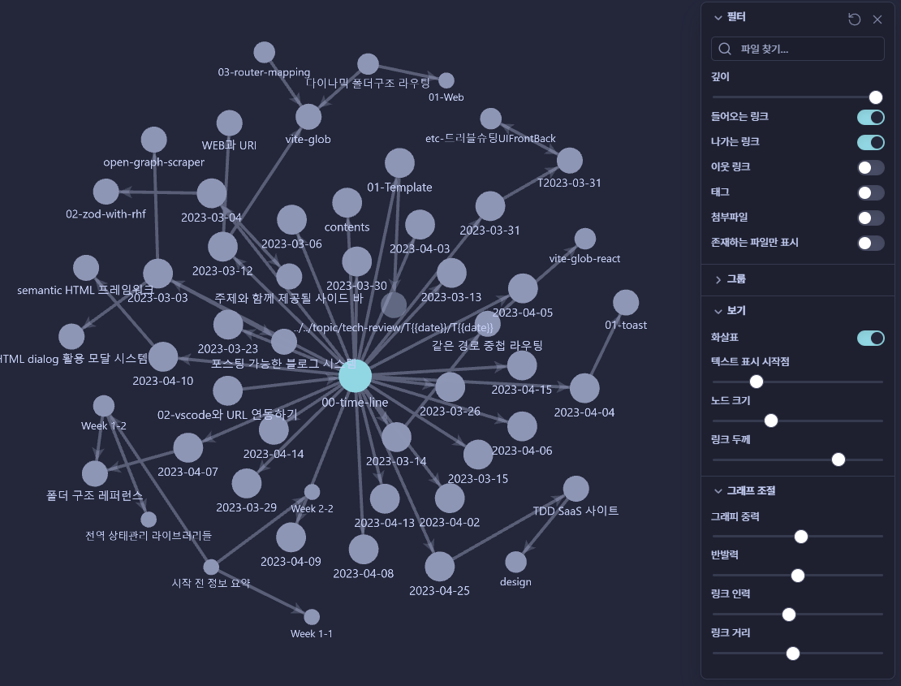
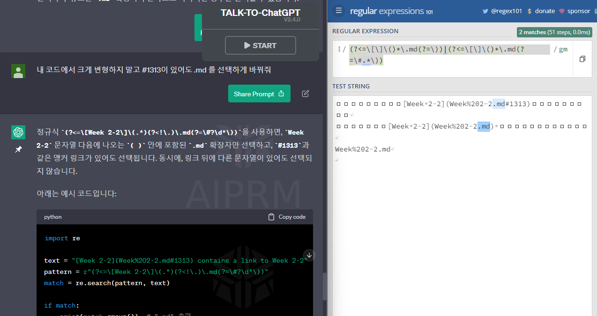
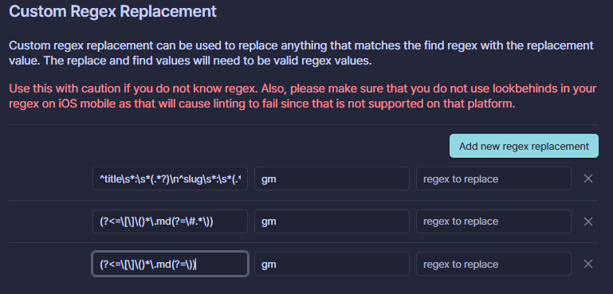
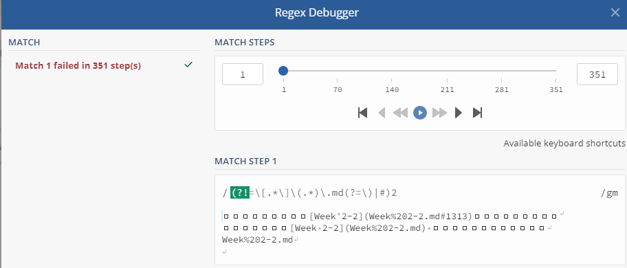
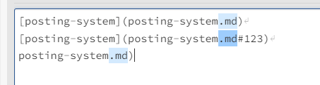

## 경로 문제 해결

### 문제 원인

현재 옵시디언을 통해 md 파일들을 관리하고 있는 상태인데
이 옵시디언이 인덱싱하는 폴더의 범위가 프로젝트 폴더 전체였었어서 node_modules 를 포함한 모든 폴더가 인덱싱 되었고
성능에 문제가 있었음

그래서 인덱싱 범위를 contents 폴더로 줄이게 됨

### 해결 방식

일단 테스트하면서 디버그하기로 함 상대경로기반으로 설정해뒀기 때문에 큰 문제는 없었지만

작업을 하다보니 기존에 옵시디언에 편의성을 위해 만들어둔
데일리 노트 > 테크 데일리 노트 연결 할 때 루트 경로에서 찾아가도록 한 것 절대경로였어서 문제가 되어 해당 기능을 수정하고
문제되는 링크들은 일단 지웠다

그리고 데일리노크가 있는 dev-softer 폴더를 블로그 포스팅 폴더에서 제외시켜서 문제 자체를 제외하게 하였다

문제를 찾을 때 옵시디언의 그래프를 통해 빠르게 찾아 제거할 수 있었음
연결되지 않은 노드는 반투명하게 나온다 지금 이미지에서 투명하게 나오는 파일은 템플릿용 파일이여서 투명하게 나온다


### docusaurus 의 link 시 최적화 문제

.md 경로가 있더라도 정적페이지 생성 할 때 폴더 상에서 링크되지 않으면 링크의 최적화를 생략하게 된다
그러면서 문제가 생김

그리고 앞글자가 숫자 일 경우 숫자를 생략하는 문제가 발생했는데
이렇게 되면 경로 자체가 깨져버렸고
이렇게 오류가 한번 발생하면 로컬링크 간에 .md 텍스트를 수정해주는 것에도 문제가 생기게 되었음

### 정규식

그래서 정규식을 짯다
chatGPT 로 질문해서 엇나가기 전까지의 기본적인 코드를 받고 나머지는 수정해서 원하는 정규식을 만들었다


예문을 주고 결과를 달라는 방식으로 요청하면 잘나온다

RegExp playground 에서 테스트하여

```RegExp
(?<=\[\]\()*\.md(?=\))
(?<=\[\]\()*\.md(?=\#.*\))
```

이 정규식을 커뮤니티 플러그인인 obsidian linter 에 넣어서 .md 를 다 삭제한다
옵시디언에서 .md 가 생략되면 자동으로 .md 로 인식하기 때문에 없어도 된다

or 연산자가 인식이 안되는 듯 하여 수정함
그런데도 적용이 잘 안됬다 아마도

그래서 보던 중에 debugger 가 있어서 정규식 해석 방식을 따라가면서 다시 제작 함
아주 잘 성공했다


## 최종 코드

```
(?!=\[.*\]\(.*)\.md(?=\)|#)
```

`(?!=` 가 뭔뜻인지 잘 모르겠다 이게 왜 됬을까

이 정규식은 먼저 `(?!=\[.*\]\(.*\))` 로 시작됩니다. 이는 이전에 매치된 문자열이 다음 패턴에 매치되지 않도록 하는 Negative Lookahead 입니다. 여기서는 `[text](url)` 과 같은 링크 형식을 찾기 위한 패턴을 매치하지 않도록 합니다.
그 다음에는 `\.md` 와 매치됩니다. 이 부분은 `.md` 라는 문자열을 찾습니다.
마지막으로, `(?=\)|#)` 는 다음에 오는 문자열이 `)` 또는 `#` 인 경우에만 매치되도록 Positive Lookahead 입니다. 이는 `](url)` 과 같은 링크 형식에서 `.md` 를 찾지 않도록 하는 역할을 합니다.
따라서, 이 정규식은 `[text](url)` 형식으로 된 링크 안에 포함되어 있지 않은 `.md` 확장자를 가진 문자열을 찾습니다.

뭔가 문제가 있을 것 같았고..실제로 있었다
[📚 JavaScript 정규 표현식 문법 총정리 + 응용 예제](https://inpa.tistory.com/entry/JS-%F0%9F%93%9A-%EC%A0%95%EA%B7%9C%EC%8B%9D-RegExp-%EB%88%84%EA%B5%AC%EB%82%98-%EC%9D%B4%ED%95%B4%ED%95%98%EA%B8%B0-%EC%89%BD%EA%B2%8C-%EC%A0%95%EB%A6%AC)


```
\.md(?=\)|#)
```

이걸로 해도 된다
앞을 검사를 안하는 것이 문제가 된다
`(?<=]()(?:[^)]+)()(?=)|#)` 에서 group 1 만 선택되도록 하는게 안됬다
하지만 원하는 기능을 수행하기 때문에 ... 임시로 사용하기로 함

- [ ] 호환되게 고치기

그리고 모든 파일에서 .md 를 삭제하여 블로그 링크가 전부 살게 되었다
