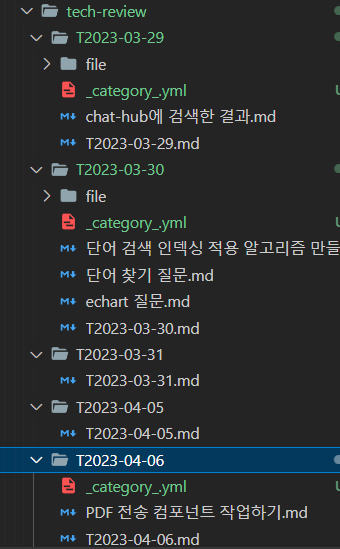

[link-issue](../link-issue/link-issue) 에서의 문제로 프로젝트 별로  
`_category.yml_` 을 만들기로 헀다

```yaml _category_.yml
position: 1 # 사이드바 순서
label: '표시할 이름'
collapsible: true # 접을 수 있는지
collapsed: false # 초기에 얼려있도록 할 것인지
className: red
link:
  type: generated-index
  title: 제목의 이름
```

## 속성 별 정의

### label

카테고리의 경우 형태가 조금 다른데 .. 이 부분은 label 의 속성이 이름으로 들어가고 깊이가 설정되지 않는다  
영어 권장  
따옴표로 감싸지 않아도 되며  
공백을 넣어도 - 로 대체된다

```
http://localhost:3000/docs/category/표시할-이름-1
```

### postion

postion 은 sidebar_position 과 우선순위를 공유한다  
없어도 된다

### className

없어도 된다

### link/title

페이지에 들어갔을 때와 리스트에서 보이게 될 이름을 정의한다 ( 한글 가능 )

### type

type: generated-index  
내부 요소들에 대한 인덱스 버튼을 자동으로 생성해준다  
가장 첫줄을 일부 보여주기 때문에 유용하다

### customProps/description

해당 속성 값은 보여지지 않았음

아마도 예시문서에서 사용된 컴포넌트에서의 기능인 것으로 보여짐  
없어도 될 것 같다  
실제로 없어도 된다

## 코드로 부여

```js
if (
  !inDstFolder.endsWith('\\file') &&
  !fs.existsSync(`${inDstFolder}\\_category_.yml`)
) {
  // file 일 경우 생성하지 않음
  const pathTest = `${inDstFolder}\\_category_.yml`;
  const fileName = inDstFolder.split('\\').pop();
  const yamlContent = yaml.dump({
    label: fileName,
    collapsible: true,
    collapsed: false,
    link: {
      type: 'generated-index',
      title: `${fileName} index`,
    },
  });

  fs.writeFile(pathTest, yamlContent, (err) => {
    if (err) {
      console.error(pathTest, yamlContent);
    } else {
      console.log('pathTest', inDstFolder);
    }
  });
}
```

## 작업에서 얻은 것

처음에 아래 코드에서  
`// 현재 위치는 폴더를 만들 때 ~ 추가 조건이 맞으면 동작한다` 이라고 작성한 곳에 위에 코드를 넣었었다  
그래서 파일을 생성해야할 경우에만 실행되서 전체 파일에 생성되지 않고 file 이 있는 곳에만 생성되어서  
세삼스럽게  
조건이 쌓이는 방식을 다시 자각했다

```js
if (fs.lstatSync(srcFile).isDirectory()) {
  // 폴더인데 dst에 없으면 만들기
  if (!fs.existsSync(dstFile)) {
    // 특정 이름의 폴더 생성 제외
    if (nameValidate(dstFile)) {
      return;
    }
    // 현재 위치는 폴더를 만들 때 ~ 추가 조건이 맞으면 동작한다
    fs.mkdirSync(dstFile);
  }
  // 폴더 안에 있는 파일들 대상으로 재귀호출
  targetFolder(srcFile, dstFile);
}
```

이렇게 작업하니 전부 잘 들어왔다

## 이런 카테고리가 불필요한 파일 조건이 있었다

바로 자기 자신 밖에 없는 단일 파일로 이뤄진 폴더다  
file 과 본인 밖에 없고 이름도 본인의 폴더명으로 지어져있어서 카테고리가 없으면 확장되지 않는 것이 카테고리에 의해 불필요하게 확장 될 수 있는 문제가 있었음

근데 내 로직의 탐색 방식은 하향식이여서 생성 될 시점에 파일이 있는지 없는지 파악하기에 제약이 있었다  
일단 카테고리가 없어도 되는 조건은

1. 상위 폴더와 유일한 md 파일의 이름이 같을 것
2. file 만 있을 것  
    이 두가지 이다

그리고 일단 이 재귀함수는 모든 파일을 순회한다  
그래서 현재 조회중인게 file 일 때와  
상위 폴더와 현재 조회중인 파일의 이름이 같을 때  
파일 생산을 생략하기로 했다

파일이 많으면 만들어지게 되어있기 때문에 두 조건에서 미뤄도 생성될 것은 생성되게 되어있었다

### 코드

```js
const pathTest = `${inDstFolder}\\_category_.yml`;
const fileName = inDstFolder.split('\\').pop();
const yamlContent = yaml.dump({
  label: fileName,
  collapsible: true,
  collapsed: false,
  link: {
    type: 'generated-index',
    title: `${fileName} index`,
  },
});
if (!inDstFolder.endsWith('\\file') && !fs.existsSync(pathTest)) {
  // file 일 경우 생성하지 않음
  if (file === 'file' || file === `${fileName}.md`) {
    console.log('생성 생략');
    return;
  }
  fs.writeFile(pathTest, yamlContent, (err) => {
    if (err) {
      console.error(pathTest, yamlContent);
    } else {
      console.log('pathTest', inDstFolder);
    }
  });
}
```

가독성을 위해 조건 성립시에만 실행되는 변수선언을 밖으로 뺐다  
안으로 넣는게 최적화가 더 잘 되는건지 외부로 빼는게 더 잘되는 것일지 조금 햇갈렸지만

좀 forEach 문 밖으로 빼면 확실히 최적화가 되는 것이였다  
file x 가 아니라 경로 수 x 가 되기 때문에 된다 #최적화

file 을 출력해보니 확장자도 포함이여서 비교 구문에 확장자를 포함함

기능도 정상 동작함을 확인함  

