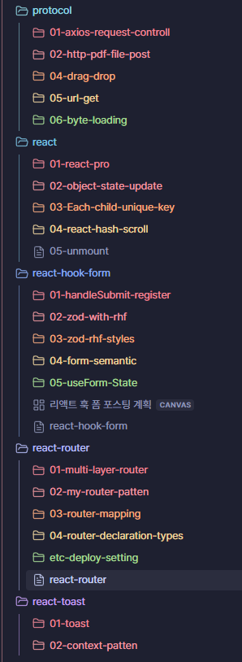
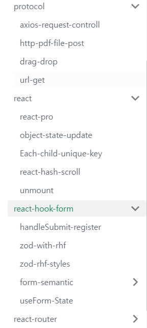

문제가 있었다  
아래 사진처럼 프로젝트 포스팅 폴더들이 구성되 있는데 배포를 하게 되면

  
  
앞의 숫자가 빠져버려서 형식을 수정해야하게 됬다  
이렇게 수정되는 형태는  
`sidebar_position: 1` 같은 식으로 제어되는데 이것을 맞추는 건 수동인 상황  
우선 배포해야하기 때문에 노가다를 하기로 했다  
내가 도큐사우르스만 사용하면 괜찮지만 다른 것들을 다 연결해서 쓰기 때문에 이 부분을 도큐사우르스에맞추기로 했다

## obsidian view sort

sidebar_position 로 정렬을 제어하게 되서 기존 숫자 정렬이 불가능하게 됬다  
그래서  
대분류 페이지에 sidebar_position 를 기준으로 정렬을 수행하는 컴포넌트를 만들기로 하게 되었다

- [ ] 1 차 목표 : dataview 를 통한 쿼리 후 sort 하는 것
- [ ] 2 차 목표 : waypoint 플러그인 수정으로 링크를 정렬 시키기
