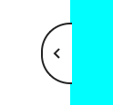
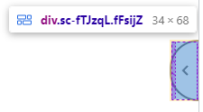

## 보더의 다양한 사용법

### `border-radius`

`border-radius: (왼쪽 위) (오른쪽 위) (오른쪽 아래) (왼쪽 아래);`
모서리에 적용되는 것이고 시계 방향으로 적용할 수 있다

### `border-{position}`

선의 개념으로 선들의 값을 부여할 수 있고
`position : left | right | top | bottom` 으로 되어있다

- 각각의 선에 다른 속성들을 부여해야할 일이 있기 때문에 자주 사용된다

### radius 와 border

radius 는 점 border 는 선을 선을 쓰기 때문에

#### radius 가

원을 표현할 때 , 값이 0 인 구간까지 곡선으로 표현된다

```css
  border-radius: 32px 0px 0px 32px;
  border: 2px solid ${colors.Black};
  border-right: none;
```

이 작업의 모양은 아래와 같다

봤을 때 뭔가 어색함을 느꼈다 > 완전 둥글지 않다는 걸 느꼈다 4px 의 차이를 감지한 것이다

## box-sizing: border-box

위 사진은 `box-sizing: border-box;` 속성이 들어가지 않은 상태다
그래서 `box-sizing: content-box;`(Default) 로 되어있고 총 사이즈는 border 을 포함한 68 사이즈이다

