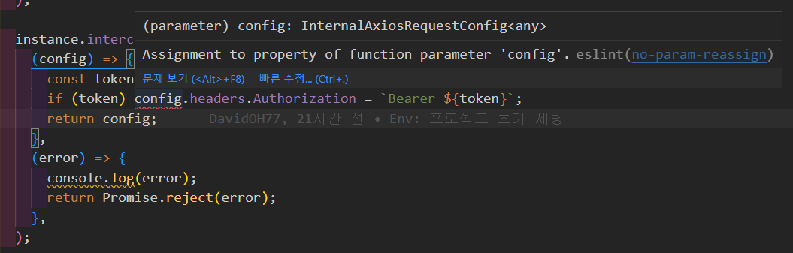

일반적으로 parameter 로 들어오는 값을 조작하는 것은
참조값을 받았을 때 원본 객체의 값을 변경시킬 수 있기 때문에
권장되지 않는 패턴인 것인 것으로 보인다

그런데 내가 궁금한 것은 단순하게
const dist = value 한 것 만으로 순수성을 보장할 수 있느냐 라는 것이 궁금해진다
객체라면 내부 주소가 그대로 살아있을 건데 ...

아 그래서 연산 결과를 반환하는 변수는 괜찮은 것 같다
`const dist = Number(value);`

그래서 아래는 오류를 발생시킨다

