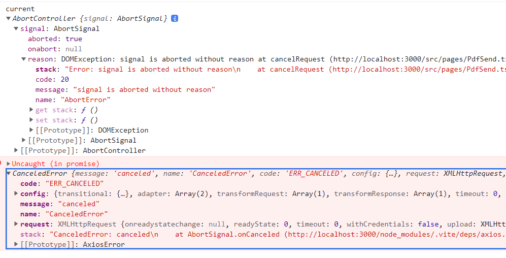

## 소개

작업 전에 interceptors 에 넣는 것과
시그널 주입으로 열린 request 를 닫는 기능을 정리했다

우선 이 작업은 팀프로젝트로 진행했던 홀리몰리 프론트 PDF 개발에 들어있다

참고는 예전에 써둿던 걸 참고 했다
[메모했던 axios 요청 취소](obsidian://open?vault=source&file=00-Project%2F03-R-%EB%B0%B1%EC%95%A4%EB%93%9C%20%ED%98%91%EC%97%85%2F02%20%ED%8C%A8%EC%8A%A4%ED%8A%B8%EC%BA%A0%ED%8D%BC%EC%8A%A4%20%EB%AF%B8%EB%8B%88%ED%94%84%EB%A1%9C%EC%A0%9D%ED%8A%B8%2F%EB%A1%9C%EA%B7%B8%EC%9D%B8%20%26%20%ED%9A%8C%EC%9B%90%EA%B0%80%EC%9E%85%2F%ED%8E%98%EC%9D%B4%EC%A7%80%20%EC%9D%B4%EB%8F%99%20%EB%A1%9C%EC%A7%81%2FQ-axios%20%EC%9A%94%EC%B2%AD%20%EC%B7%A8%EC%86%8C%EC%97%90%20%EB%8C%80%ED%95%B4)

취소를 위한 로직에서 레거시 패턴은 cancelToken 이고
최신 패턴은 AbortController 이다

config 의 signal 에 값을 넣어서 사용한다
한번 abort() 되면 계속 요청을 비활성화 시키기 때문에 새로운 컨트롤러를 전송 이벤트 발생 시 넣어줘야한다

```tsx
// react에서 시그널 불변성 보장
const controllerRef = useRef(new AbortController());

// 취소 동작을 캡슐화해서 사용 ( 이름을 간소화하고, 호출 구조의 캡슐화 )
const cancelRequest = () => {
  controllerRef.current.abort();
};

// reset
controllerRef.current = new AbortController();

//config
signal: controllerRef.current.signal;
```

### abort 사용하는 패턴 예시

[(번역) AbortController는 당신의 친구입니다](https://velog.io/@sehyunny/abort-controller-is-your-friend)

- `AbortSignal.timeout(ms)`: 일정 시간 이후에 자동으로 중단되는 단일 `AbortSignal` 을 생성합니다. 필요하다면 쉽게 생성할 수 있습니다.

```js
function abortTimeout(ms) {
  const controller = new AbortController();
  setTimeout(() => controller.abort(), ms);
  return controller.signal;
}
```

- `AbortSignal.any(signals)`: 전달된 시그널 중 어떤 하나라도 중단되면 중단되는 시그널을 생성합니다.
- 다시 한번 말씀드리면, 이를 여러분 스스로 구성할 수 있습니다. 하지만 주의하셔야 할 건 아무런 시그널도 전달하지 않으면 파생된 시그널은 *절대* 중단되지 않습니다.

```js
function abortAny(signals) {
  const controller = new AbortController();
  signals.forEach((signal) => {
    if (signal.aborted) {
      controller.abort();
    } else {
      signal.addEventListener('abort', () => controller.abort());
    }
  });
  return controller.signal;
}
```

- `AbortSignal.throwIfAborted()`: 중단됐을 경우 에러를 발생시키는 `AbortSignal` 의 헬퍼입니다. 이를 통해 계속 확인하는 동작을 방지할 수 있습니다. 아래와 같이 사용할 수 있습니다.

```js
if (signal.aborted) {
    throw new Error(...);
  }
  // 아래와 같이 됩니다
  signal.throwIfAborted();
```

폴리필하기 더 어렵지만, 다음과 같이 헬퍼를 작성할 수 있습니다.

```js
function throwIfSignalAborted(signal) {
  if (signal.aborted) {
    throw new Error(...);
  }
}
```

## AbortController 구조

정확히는 siganl 과 .abort() 가 있다
시그널에서 aborted 라는 속성을 통해 정지 실행여부를 확인 가능하다

### signal.aborted

false 가 실행되지 않은 것이고 true 가 실행된 것...

