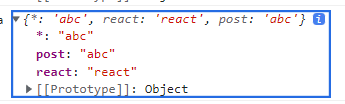

## 소개

일단 와일드카드인 `*` 을 통해 공백도 포함되게 할 수 있다
컴포넌트에서 실행된 useParams 는 어디에 있던 주소의 값을 가져오고
여러개의 값을 가져올 수 있다


여기서 왜 `*` 이 있냐면
여기서 `*` 은 `*` 이 사용된 시점부터 전체 url 을 뜻하며
매번 선언할 때마다 갱신되서 아래 코드로 쓰면 위처럼 나온다
만약 아래코드에서 Header 를 제외한 `*` 을 삭제할 경우 `*: 'learn/react/abc'` 이 된다
해보니까 `*` 없어도 실행도 되더라 ( 최상위는 있는게 좋을 거 같다 )

```tsx
    <Route path="/*" element={<Header />}>
      <Route path="" element={<Root />} />
      <Route path="learn/*" element={<Learn />}>
        <Route path="" element={<LearnIndex />} />
        <Route path=":subject/*" element={<Dashboard />}>
          <Route path="" element={<LearnIndex />} />
          <Route path=":post" element={<PostRouter />} />
        </Route>
```

## 개선

```tsx
    <Route path="/*" element={<Header />}>
      <Route path="" element={<Root />} />
      <Route path="learn" element={<Learn />}>
        <Route path="" element={<LearnIndex />} />
        <Route path=":subject" element={<Dashboard />}>
          <Route path="" element={<LearnIndex />} />
          <Route path=":post" element={<PostRouter />} />
        </Route>
```

여기서 "" 은 그 주소에 대한 임시 홈이 되는 기능을 가지고 있다

## PostRouter 는 어떻게 썼는지

아직 개선할 부분이 있다
subject 을 반영하지 않았다
이거 약간 문제가 있는데...
`:subject` 도 가져오는 요소가 있다
어짜피 outlet 으로 컴포넌트 분리가 가능하긴 하지

```tsx
import { Navigate, useParams } from 'react-router-dom';
import NodeIntro from '@/contents/back/node/01-intro';

type Props = {};

const PostRouter = (props: Props) => {
  const { post } = useParams();
  console.log('post', post);
  // 임시

  const Post = () => {
    // 임시 사용
    switch (post) {
      case '01-intro':
        return <NodeIntro />;
      default:
        return <Navigate to="/404" replace />;
    }
  };

  return (
    <>
      {Post()}
      하이
    </>
  );
};

export default PostRouter;
```
