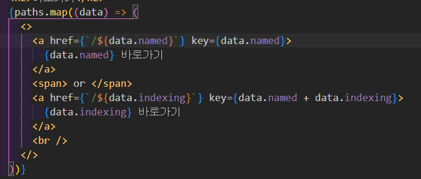
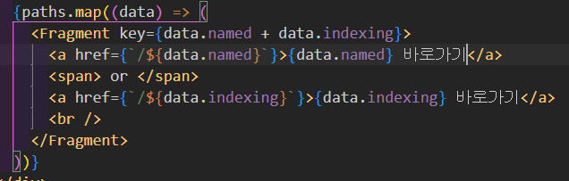

만약 텍스트 단위로 반복되야하는 상태에서  
난 절대로 div 로 붙이기 싫은데 key 를 붙여야한다  
축약형인 빈 Fragment 에는 key 를 붙일 수 없다  

그럼 명시적으로 선언하고 키를 넣으면 된다  
[Fragments – React](https://ko.legacy.reactjs.org/docs/fragments.html#keyed-fragments)  
[New Docs Fragment- React](https://react.dev/reference/react/Fragment)

