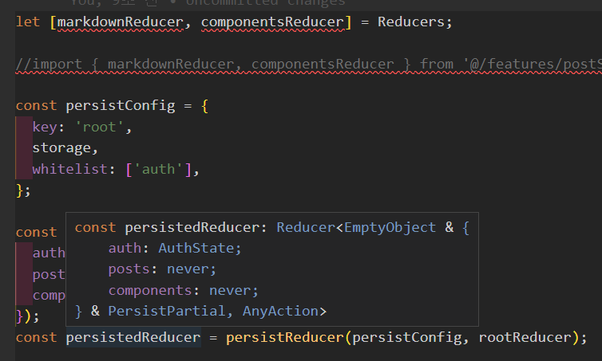

## 소개

안티패턴 소개
음... 기능은 잘되는데 왜 안티패턴이냐.... 음....
추론이 안되잖아 어딘가에 소실되는 영역이 있어서 그런거 아닐까?? 라는 의견
일단 Default 여서 참조형으로 변하면서 안되는 것 같음

```tsx
import type { PayloadAction } from '@reduxjs/toolkit';
import { createSlice } from '@reduxjs/toolkit';
import type { RootState } from '@/app/store';
import { components, markdowns } from '@/router/Router';

const postState = markdowns;

export const markdownSlice = createSlice({
  name: 'posts',
  initialState: postState,
  // The `reducers` field lets us define reducers and generate associated actions
  reducers: {},
});

const componentsState = components;

export const componentsSlice = createSlice({
  name: 'components',
  initialState: componentsState,
  // The `reducers` field lets us define reducers and generate associated actions
  reducers: {},
});

interface SubjectObject {
  [key: string]: Subject[];
}

interface Subject {
  index: string;
  path: string;
}

export const selectSubject = (state: RootState) => {
  const result: SubjectObject = {};
  state.posts.forEach((post) => {
    const splitPath = post.path.split('/');
    if (result[post.category] === undefined) result[post.category] = [];
    result[post.category].push({ index: splitPath[1], path: post.path });
  });
  console.log('selectSubject', result);

  return result;
};
export const order = ['front', 'back', 'work', 'language', 'blog'];
export default [markdownSlice.reducer, componentsSlice.reducer];
```

이 방식으로 했을 때
store.tsx 에서 이런식으로 받았다

```tsx
import Reducers from '@/features/postSlice';
const [markdownReducer, componentsReducer] = Reducers;
```

그랬더니 타입추론이 Never 로 되버림
그래서 원래 형태인

```tsx
export default markdownSlice.reducer;
```

로 바꿨더니 잘 됬다 여기서...
이 `[object, object]` 형태가 문제를 일으킴을 알 수 있었다
그래서
`export authSlice.reducer` 를 해야하는 상황이여서... 어떻게 하나 시도를 해봤다

slice.tsx

```tsx
export const markdownReducer = markdownSlice.reducer;
export const componentsReducer = componentsSlice.reducer;
```

store.tsx

```
import { markdownReducer, componentsReducer } from '@/features/postSlice';
```

이 작업을 하면서 export 시 감싸서 보내는 것이 문제를 발생시킬 수 있음을 알 수 있었다
아마도 const 형태여서 그런걸까 라는 추론을 뒤늦게 해보았다 > let 으로 바꿔봄
작동에 문제는 없었지만
동일한 문제로 추론이 잘되지 않는 것을 알 수 있었다



## 변경 후 코드

```tsx
import type { PayloadAction } from '@reduxjs/toolkit';
import { createSlice } from '@reduxjs/toolkit';
import type { RootState } from '@/app/store';
import { components, markdowns } from '@/router/Router';

const postState = markdowns;

export const markdownSlice = createSlice({
  name: 'posts',
  initialState: postState,
  // The `reducers` field lets us define reducers and generate associated actions
  reducers: {},
});

const componentsState = components;

export const componentsSlice = createSlice({
  name: 'components',
  initialState: componentsState,
  // The `reducers` field lets us define reducers and generate associated actions
  reducers: {},
});

interface SubjectObject {
  [key: string]: Subject[];
}

interface Subject {
  index: string;
  path: string;
}

export const selectSubject = (state: RootState) => {
  const result: SubjectObject = {};
  state.posts.forEach((post) => {
    const splitPath = post.path.split('/');
    if (result[post.category] === undefined) result[post.category] = [];
    result[post.category].push({ index: splitPath[1], path: post.path });
  });
  console.log('selectSubject', result);

  return result;
};
export const order = ['front', 'back', 'work', 'language', 'blog'];

export const markdownReducer = markdownSlice.reducer;
export const componentsReducer = componentsSlice.reducer;
```
