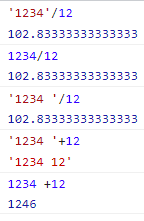
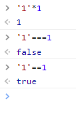

## isNumber

### ( value : number ) => boolean

부득이 하게 0/0 을 또는 1/0 하게 될 때 쓰는
NaN , Infinity 식별

"123" 은 문자열로 보는 문제가 있음

## 처음 만든 것

```js
const isNumber = (value: any) => {
    if (value === null || value === undefined) {
      return false;
    }
    if (typeof value === 'number') {
      if (Number.isNaN(value)) {
        return false;
      }
      if (!Number.isFinite(value)) {
        return false;
      }
      return true;
    }
    return false;
  };
```

## isNaN 사용

그런데 내가 자바스크립트를 써도 자동 처리 되더라
isNaN 으로도 처리가 된다
정확히는 Number.isNaN()
그래서 오히려
'1234' false
'1234v' true
로 나온다

즉 숫자는 false 가 나온다
문자는 false 가 된다
string 까지 isNaN 으로 처리해준다


그래서

```js
function isNum(s) {
  s += ''; // 문자열로 변환
  s = s.replace(/^\s*|\s*$/g, ''); // 좌우 공백 제거
  if (s == '' || isNaN(s)) return false;
  return true;
}
```

[자바스크립트 숫자 여부 판단 함수, 숫자인지 문자인지, isNum, isNumeric, isNumber JavaScript](https://wolf-coding-777.tistory.com/9)

그래서 string 까지는 붙여줘야하나 생각이 들었으나
타입 가드를 고려해야하지 않을까 라는 생각이 든다

```js
if (typeof value === 'number' || typeof value === 'string') {
```

## 최종적인 코드

최종적인 코드는 아래같이 되었다

```js
const isNumber = (value: any) => {
    if (value === null) {
    // if (value === null || typeof value === 'string') {
      return false;
      // Number에서 undefined 는 NaN으로 처리 됨
    }
    const dist = Number(value);

    if (Number.isNaN(dist)) {
      return false;
    }
    if (!Number.isFinite(dist)) {
      return false;
    }
    return true;
  };
```

`value = Number(value);` 쓰다가 아래 린트 오류가 떠서 린트의 이유를 작성 했다
[Error-no-param-reassign](../../../front/eslint/Error-no-param-reassign.md)

내가 걱정하는 것은 '1234' 에 의한 숫자 에러인데
`if (value === null || typeof value === 'string') {`
그럴 경우 그냥 문자는 돌려보내자
