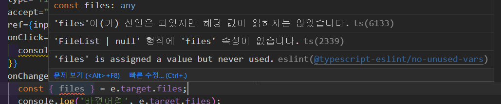

## 소개

files 는 type file 일 때만 사용하는 HTMLFileInputElement 의 속성이다
그리고 Files 는 FileList 형태를 띄고 있고 무조건 length 가 있다

```ts
interface FileList {
  readonly length: number;
  item(index: number): File | null;
  [index: number]: File;
}
```

그런데 자주 사용되는 ( 추천 타입.. ㅋㅋㅋ 코파일럿의 한계였던 것 같기도 하다 )
`ChangeEvent<HTMLInputElement>` 만 사용한다

files 가 input type='file' 일 때 무조건 있는데 사용한 HTMLInputElement 는 input 태그에 공통적으로 사용하다보니 nullable 해서..!
null 일 수 있다는 에러가 발생했다


type='file' 인 이상 target 에 files { length } 은 무조건 있다
HTMLInputElement 으로 input 을 통째로 관리하고 files 는 FileList | null 이여서 생기는 에러
굳이 null 체크를 하지 않아도 된다. (length 로 체크하면 된다)

### 가장 범용적인 방법

`if (event.target.files) {` 으로 감싸서 실행하거나
`if (!event.target.files) return` 으로 리턴한다

```ts
const handleFileInput = (event: ChangeEvent<HTMLInputElement>) => {
  if (event.target.files) {
    const files = event.target.files;
    // ...
  } else {
    // Handle the case where no files were selected
  }
};
```

### 내가 적용한 방법

나는 굳이 ts 때문에 js 가 오염되는게 싫었다
그래서 null 이 아니라고 표시하기로 했다

```ts
interface HTMLFileInputElement extends HTMLInputElement {
  files: FileList;
}
```

## 그 외 제시 된 방법

### 객체 구조분해

위 사진에서 사용된 방법인데
`const { files } = e.target;`
그런데 이 방법도 마찬가지로 null 에러가 발생하는 방식

### type assertion ( as )

type assertion 이 뭔지 몰랐다
`const file = e.target.files as FileList`

이 방법도 나쁘지 않다는 생각이 들었다

### type narrow

narrow 하는게 가장 간단하다해서 찾아봤다
알아보니 그냥 조건문으로 처리하는 것이였다

[TypeScript: Documentation - Narrowing](https://www.typescriptlang.org/docs/handbook/2/narrowing.html)
`if (typeof padding === "number") ~`
처럼 if 쓰는 것 단 object 는 쓰면 안된다 > 인터페이스로 만들어서 쓰던가 해야 함

미리 선언한 객체 데이터가 있다면
객체를 타입으로 바꿀 수 있는데

[Type Narrowing. “타입의 범위를 좁히면 코드가 더욱 안전해집니다.” | by QQQ | nodejs backend | Medium](https://medium.com/nodejs-server/type-narrowing-ts-f62fc28f413f)
