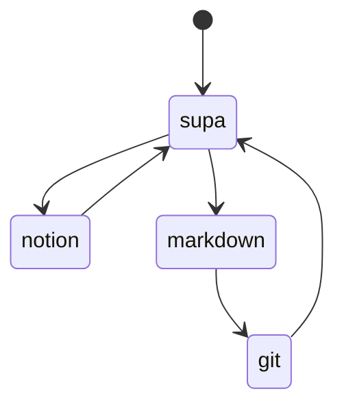
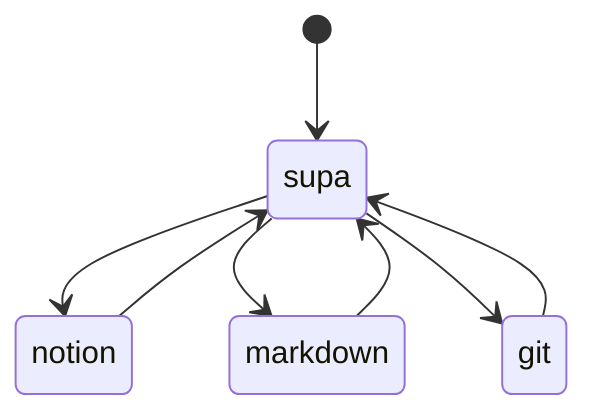
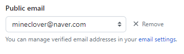
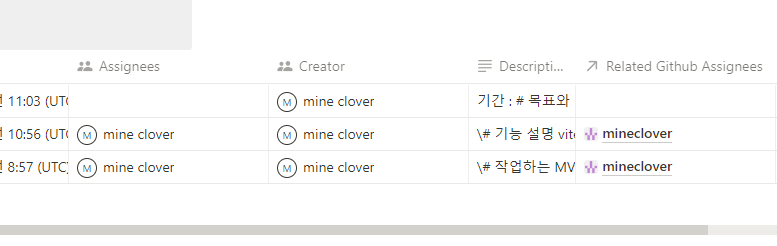
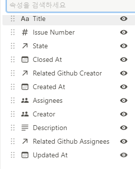

backlog-integration : 백로그 통합

supa base 에다가 notion api 호출을 달아서  
notion , github 기타 등등을 통합시키는 계획  
일단 DB 로 동기화 되면 이후는 좀 간단해진다

```

```

- [ ] 구조 :
- [ ] 목표 :
- [ ] 사전 조사 : 기존 서비스가 있음

## 구조



이렇게 권한별로 다른 처리를 하도록 만들거나



통합 관리 두가지가 있는데  
supa 를 통해서만 제어하는 것이 인터페이스를 만들고 관리하는 것에 대해서 더 간단하다

전자의 경우 설계 단계에서부터 각 플랫폼 별 목적을 제한하고 들어가는 것임  
그만큼 구현해야할 양이 줄어들지만 자유도가 떨어진다  
( 어느건 입력만 어느건 출력만 신경쓰면 되기 때문 )

후자의 경우 플랫폼 별 입출력을 완전히 구현해야하기 때문에 각 플랫폼에대한 높은 이해도를 필요로 하게 된다

## 사전 조사

backlog integration notion github 로 검색하니 바로 나왔다

### Unito

일단 있다 근데 가격이 미쳤다

월 24 달러 > 3 만원  
하지만 이미 있다라는 것은 그 기획의 수요를 알 수 있게 해준다

[GitHub + Notion Integration | Unito Two-Way Sync](https://unito.io/integrations/github-notion/)

### 노션

[GitHub Integrations | Connect Your Apps with Notion](https://www.notion.so/integrations/github-cdc46cd9-f0e9-48fd-b3aa-18481098e29e)  
사실 노션에 있는것만으로 거의 끝나긴 했다  
사용 방법만 알면 끝날듯  
[How to embed GitHub in Notion - Plus](https://www.plusdocs.com/blog/how-to-embed-github-in-notion)

git 연결에서 연결하고자하는 저장소를 연결하고  
이슈 테이블 페이지 또는 PR 테이블 페이지의 링크를 복붙하면  
테이블이 동기화 된다

[링크 미리보기와 동기화된 데이터베이스 – Notion (노션) 도움말 센터](https://www.notion.so/ko-kr/help/link-previews-and-synced-databases?fredir=1)  
만든 사람의 정보를 알 수 없는데 (git 링크 제외) 그 부분은 도움말 센터를 확인해서 고칠 수 있다  
프로필 설정에서 아래 부분을 수정하면 바뀌는데 문제가 있다  


github 의 public email 과 notion 의 로그인 이메일이 같아야 한다  
나는 두개를 다르게 쓰고 있었기 때문에 문제가 발생했다  
그래서 계정을 하나 더 만들어서 테스트했더니 됬다  


#### 단점

- 일단 내용이 노트로 생성되지 않고 그냥 속성에 다 포함되서 생성된다
  - 이슈의 내용까지도 속성으로 들어간다
- 수정이 안된다
  - readonly update 방식이다
  - 체크리스트도 동기화 되지 않으며 체크할 수 없다
  - 그저 보여주기만 함

### 내 기획

일단 필수 속성은 대부분 git 에 의해 발생한다

(file name) => 노션과 md 파일에 필요한 속성  
labels => tags  
title => 노션에서는 파일명  
assignees => 노션에서는 매핑이 필요함  
slug => Aliases ( 마크다운으로 git 이슈 번호를 저장하거나 조회하기 위함 )  
milestones

선택  
about

이정도가 있다  
기존 동기화를 보니까  
좀 더 많은 속성이 있으니 참고해도 좋을 것 같다  


일단 노션의 문제는 속성이 아닌 것에 대해 상태관리가 되지 않는다는 것에 있다  
내부에서 체크가 있던 없던 생기던 사라지던 데이터베이스 뷰에서 그것을 확인 할 수 없다  
그리고 description 은 내용을 그대로 가져온다

그래서.. 간단한 기능으로는  
그냥 `- [ ]` 형태를 순서대로 추적하고 갯수를 세서 퍼센트를 표시하고  
마찬가지로 순서대로 세서 변경이 발생하면 똑같이 만들어주는 것을 수행하도록 하는 것

전체 구문 분석을 하지 않으면 난이도가 낮아진다
