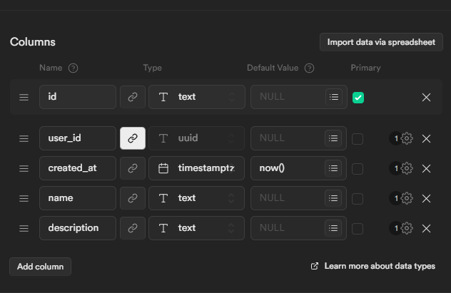

[supabase](../../../back/supabase/supabase) 로 제작했다

설계 의도는  
id 에는 텍스트를 넣을 것이다  
primary 키가 index 키로 사용된다고 해서 일단 간단하게 작업하기 위해 id 에 text 를 넣었다

한단계 추상화하는 것은 id 에 숫자 넣고 name 에 text 넣은 것을  
로컬에서 찾을 때는 글자 단위로 찾지만 실제로는 쌍이 맞는 id 를 전송시키는 것인데  
그거 말고도 할게 많기 때문에 id 를 하나로 넣었다  
  
이후 name 은 용도가 겹쳐서 지웠다

그 후 업로드를 위한 [DB-insert](../../../back/supabase/DB-insert/DB-insert) 작업을 함
