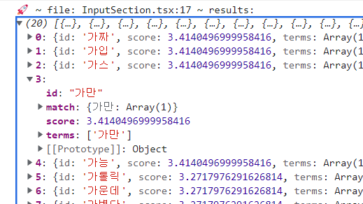
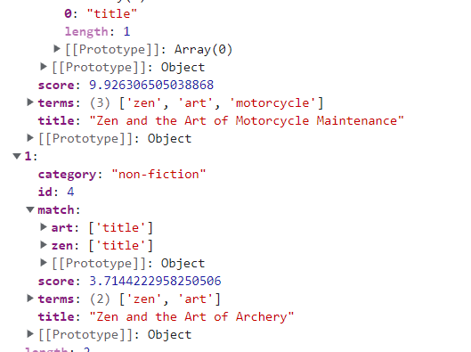

[GitHub - lucaong/minisearch: Tiny and powerful JavaScript full-text search engine for browser and Node](https://github.com/lucaong/minisearch)  
new MiniSearch 으로 검색엔진을 정의한다  
fields : 검색 대상이 되는 속성의 이름  
storeFields : 검색 대상의 카테고리 ... 필터링

잘 된다  


```tsx
import MiniSearch from 'minisearch';
import test from './search.json';

const miniSearch = new MiniSearch({
  fields: ['id'], // fields to index for full-text search
  storeFields: [], // fields to return with search results
});

miniSearch.addAll(test);

const results = miniSearch.search('가', { prefix: true });
console.log('🚀 ~ file: InputSection.tsx:17 ~ results:', results);
```

## prefix 옵션을 쓰지 않을 경우

가 만 하면 안되고 가까이 같이 정확히 작성해야 매칭이 된다

영어랑 차이점을 분석해보자면 형태소 분리 검색을 하는 것으로 보인다  
성공 결과의 속성 값으로 들어오는 값을 보면  
검색 값 : zen art motorcycle 인데  
match 랑 terms 에 보면 검색된 곳들이 나오는데 그게 가리키고 있는게 명확함  
애초에 덩어리지게 검색을 한다



그래서 테스트 데이터에서 공백을 지우니까 못찾는다

## 형태소 분리를 해서 쓰는 것 에 대해

결론 이걸 쓰려면 형태소 분리기...로 ㄱ ㅏ ㄲ ㅏ ㅇ ㅣ  
미리 만들면 되지 않을까

searchText 속성에 " ㄱ ㅏ ㄲ ㅏ ㅇ ㅣ " 이렇게 저장되게 만든 값을 넣고  
반환 값에 원본값이 포함되게 반환

그러면 ?  
원래 구상했던 단어 단위 별 검색이 가능은 해진다  


### 이 방식의 문제점

그래서 간단한 검증..  
순서가 다르면 인식을 하면 안 된다  
그런데 인식을 했다

## 검색 엔진 자체에 옵션

가장 내가 원하는 동작을 하는 코드  
기본 값을 설정하고  
index 를 결과값에 포함하는 구조

```ts
const miniSearch = new MiniSearch({
  fields: ['id'], // fields to index for full-text search
  storeFields: ['index'], // fields to return with search results
  searchOptions: {
    prefix: true,
  }, // fields to return with search results
});

miniSearch.addAll(test);

const results = miniSearch.search('가');
console.log('🚀 ~ file: InputSection.tsx:17 ~ results:', results);
```
