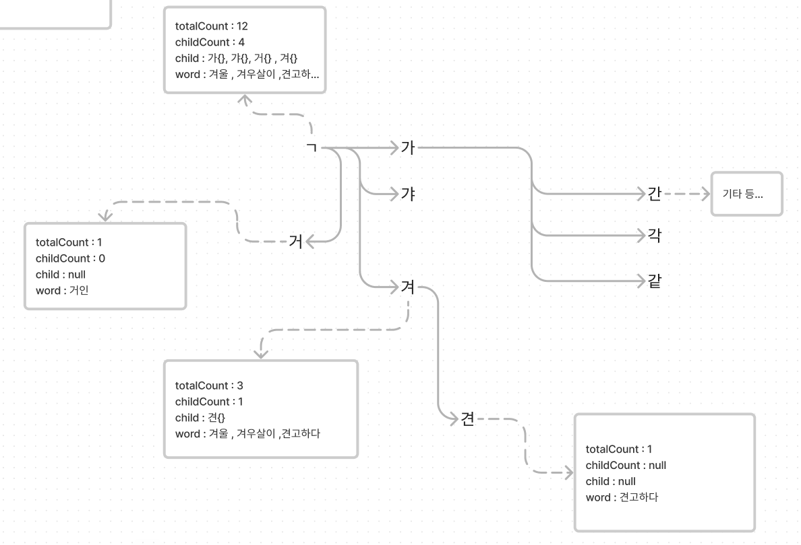
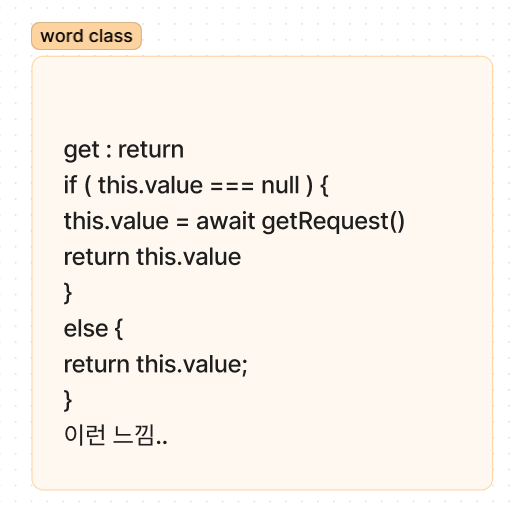

전체리스트를 받아서 검색 하기 쉬운 형태로 만들어서 빠른 검색을 적용하려한다
작성할 수록 DB 설계와 연결된 기분을 받는다
왜냐면 잘 짜여진 인덱스 검색 구조가 필요하기 때문

네이버의 컨텍스트 자동완성.. 느낌의 검색엔진이다
이미 검색될 대상이 있다는 것을 전재로 한다

프론트에 이 검색엔진을 넣으려는 목적으로 기획했다

쉬운 것 부터 해보자 우선 기획은 아래와 같다

## 범주로 찾기

가 - 깋 에 해당하면 ㄱ
까 - 낗 에 해당하는 건 ㄲ
나 - 닣 에 해당하면 ㄴ

미리 인덱싱 한 것과 미리 인덱싱 하지 않은 것의 차이 비교
클래스 문법을 적용할 수 있나? 아니면 그냥 객체에 넘버링해서 페이지 네이션 할까
자바스크립트에서는 배열도 object 여서 딱 지정해서 1 번 달라고 하면 그것만 준다
불필요한 탐색 안한다

###

[[mini-search-test]]

## 형태소 분석?

간 이면 ㄱ ㅏ ㄴ 으로 쪼개서 검색하는 초성 검색엔진..

ㄱ ㅏ 는 가에서 갛 전까지

얼마나 일치하는지
ㄱ 일 때 : ㄱㄴㄷ, 가나다 , 간다
가 일 때 : 가나다, 간다
간 일 때 : 간다

[GitHub - e-/Hangul.js: 한글 자음/모음 분리/조합 자바스크립트 라이브러리. 자바스크립트 한글 오토마타 구현체입니다.](https://github.com/e-/Hangul.js)

자바스크립트에서 운용되는 검색 엔진 생성기
한글 단어 인식해서 미리 저장된 사전의 정보와 매칭되는 데이터로 자동 완성 해주는 검색 엔진 제작
Search engine generator running in JavaScript
Create a search engine that recognizes Korean words and auto-completes them with data that matches information from a pre-stored dictionary.

[리액트로 자동완성은 어떻게 만들까(3) - 데이터구상과 자동완성기능](https://velog.io/@goldbear2022/%EB%A6%AC%EC%95%A1%ED%8A%B8%EB%A1%9C-%EC%9E%90%EB%8F%99%EC%99%84%EC%84%B1%EC%9D%80-%EC%96%B4%EB%96%BB%EA%B2%8C-%EB%A7%8C%EB%93%A4%EA%B9%8C3-%EB%8D%B0%EC%9D%B4%ED%84%B0%EA%B5%AC%EC%83%81)

가장 쉬운 방법은 그거다
필요한 범위 별 유니코드들을 전부 정리한다
가면 가부터 갛 까지 겠지
갛 유니코드 + 1 이 개 면 성공한거다
이렇게 모든 범위를 조지고 테스트 코드를 돌려본다

[한국어-유니코드 변환 도구](https://www.learnkoreantools.com/kr/korean-to-unicode)
가 - 힣 까지에서 내 코드 전체를 돌렸을 때 남는 단어가 없으면 된다

이걸 테스트 하려면 hex 코드에 +1 할 수 있고 유니코드로 변환할 수 있으면 된다

현재 문제점은 특정 범위에 .. 그러니까
가에서 갛 까지에 무엇이 들어있는지 모른다는 것

내가 원하는 건 만들어질 수 있는 단어까지 감안한 텍스트를 추려내는 것이고
필요하다면 그 텍스트들이 인기 순으로 한번더 정렬되도 좋을 것 같다 라는 것이다

#아이디어
두번째 문제는 파일을 전송하거나 생성해서 저장하게 하고 싶다
[[front-json-backdoor]]

### 이미 있는 검색 엔진 예시

[[강좌] 검색엔진 입문에서 응용까지 (3) < 강좌 < 기사본문 - 컴퓨터월드](https://www.comworld.co.kr/news/articleView.html?idxno=49537)

### 라이브러리도 있다

다양한 곳에 접목하기 좋은 FZF 검색
[GitHub - ajitid/fzf-for-js: Do fuzzy matching using FZF algorithm in JavaScript](https://github.com/ajitid/fzf-for-js)

이미 있는 검색엔진 한번 써보자
[GitHub - lucaong/minisearch: Tiny and powerful JavaScript full-text search engine for browser and Node](https://github.com/lucaong/minisearch)

## 구현 시나리오

우선 유니코드 찾는 범위가 맞는지를 검증해야한다
한글로 추정되는 범위를 전부 찍어보고 각 자모음 별 범위를 특정할 수 있어야한다

다음은 성능 최적화다

일단
ㄱ 가 간을 각각 구분해서
ㄱ일때는 가 - 깋 까지
가 일 때는 가 - 갛까지
간일 때는 간 - 갆 까지
추적해서 본인이 찾는 것들을 수집 해야한다

템플릿 리터럴를 정규식에 넣는 건 여기 나온다
[자바스크립트-ES6분석번역본](../../../site/develop/자바스크립트-ES6분석번역본)

저렇게 가일 떄는 갛 까지 니 일 때는 닣 까지 라고 하는 것들을 규칙처럼 만들어서 자동화 할 수 있는 요소가 있는 지 확인해야한다
그리고
위 작업을 통해서 입력한 단어에게 맞는 정규식을 뽑아주는 작업을 1 차 작업으로 한다

이걸 다 하면
자모음으로 분리되는 단어에 맞춰서 객체를 만드는 작업을 생각하고 있다

ㄱ > 가 , 갸 , 거 , 겨... > 가.각, 가.간, 가.갇

데이터가 커질 경우 길이 별로 구분하는 것을 고려하고 있다
하지만 길이를 고려한다라는 것은 초성 검색과 거리가 멀어지기 때문에 정말 많은 단어를 관리해야하는 검색엔진이 아닌 이상
고려하지 않아도 될 것 같다
대충 네이버 수준이 되면 길이까지 관리 대상으로 삼을 수 있어보임
또는 단어 필터링에 단어 수를 넣게 되면 고려할 수 있음 , 이 경우 속성으로 길이를 추가할 수 있음

그리고 각 초성 객체의 속성으로 가지고 있는 단어 수를 저장해서 없을 경우 표시하지 않는 방식으로 진행하는 것이다
그리고 저 단어들 역시 값을 담고 있는 클래스 객체 느낌으로

값이 없으면 서버에 요청해서 받아오는 구조로 제작

이게 딱 맞는 검색 엔진이라고 생각했었다

너무 깊은 것 같다 나중에 하자

또...
자음 검색 엔진도 있는데...
특정 형태를 만족할 경우 검색되게 하는 기능
이건 오히려 단어가 특정 형태에 참조 된다

특정 형태에는 ㄱㄴㄷ 같은게 되거나 ^가 + 가 될 수 있는 것..
