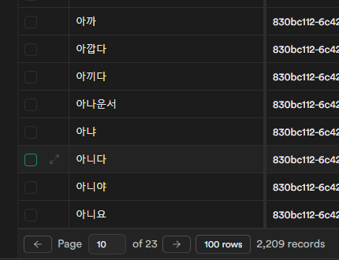
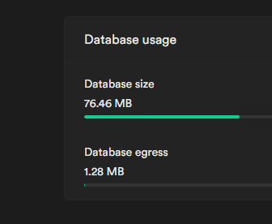
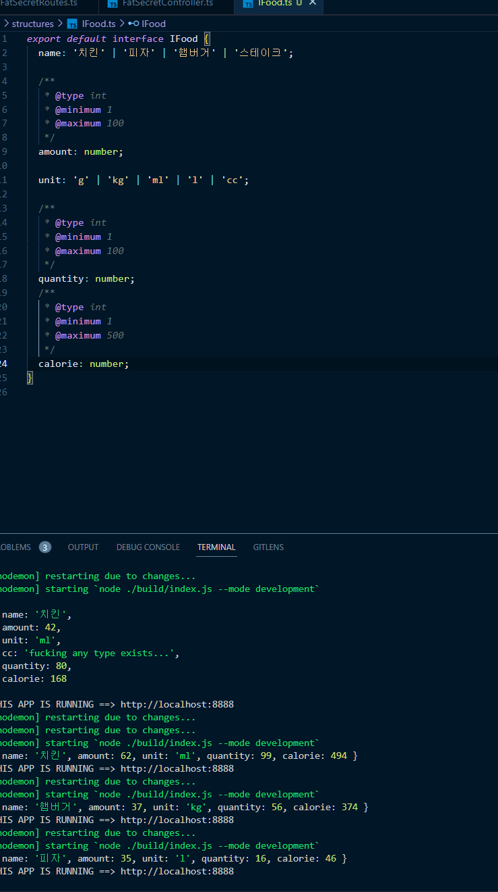

## react

이전 [db-setting](../db-setting/db-setting) 작업에 이어서  
자동 생성으로 테스트할 텍스트 약 2000 개 정도를 만들려고 한다

typia 의 도움을 받아보기로 했다  
처음에 react 에 접목하려했는데 오류가 있어서 실패했다  
[first-start](../../../back/typia/first-start/first-start)

## node

그래서 node 로 하기로 노선을 변경함

node 도 잘 안됬다..  
[node-setting](../../../back/typia/node-setting/node-setting)

## csv supabase

그래서 그냥 excel 에 한국어 사전 뽑아서 중복 텍스트 다 지우고 텍스트 붙여 넣기로 넣었다  
2,209 개 정도 들어갔고 ㄱ~ㅎ 가 적당히 잘 섞여 들어갔다  
  
이렇게 해도 76MB 라 좀 놀라웠다  
근데 csv 는 300KB 도 안되서 약간 역체감이 들었다  

## 성공한 케이스를 보니까 작업 방식이 조금 달랐다

