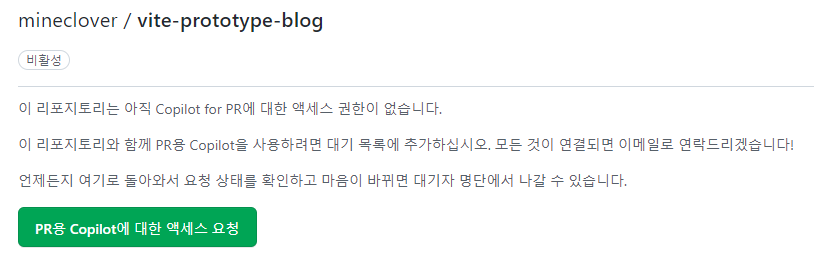
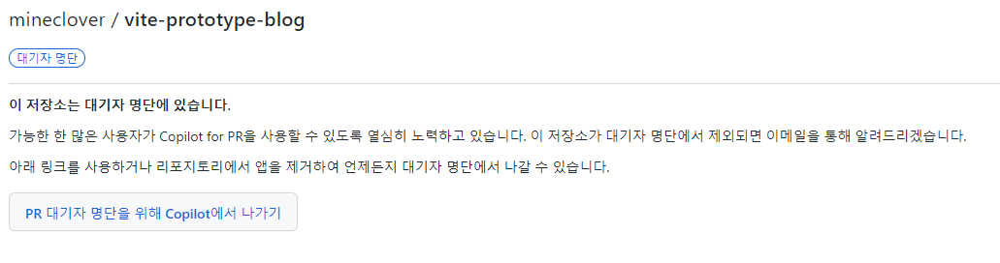

많은영감을받은날

## 알게된 것

### copilot x 대기자 등록함

[코파일럿 X 쓰면 코파면서 코딩가능 엌ㅋㅋㅋㅋ - YouTube](https://www.youtube.com/watch?v=nTmAveylPjk)

copilot x 에서 여러가지 기능이 있었다 ( 프리뷰에서 확인 및 대기자 등록 가능 [The latest GitHub previews · GitHub](https://github.com/features/preview))
상위 3 개의 기능 for pull requests , chat, for Docs 에 관심이 가서 대기자 등록을 하게 되었다

Docs 은 정보 수집에 유용해보였다 > 웹 사이트 인 것으로 보인다
Chat 은 코드 리뷰를 받거나 테스트 코드를 받아볼 수 있는 기능을 얻고 싶었다 > 사용 IDE 에 들어가는 것
pull request 는 작업 추적과 설명 제안을 한다고 하는데

- 내가 이슈로 기능 명세서를 작성한 후 명세서 대로 작성한다 했을 때
- 작업된 것을 풀 리퀘스트해서 올리면 그것에서 얼마나 잘 내 의도를 읽어내는지 궁금해졌다
- 어떻게 해석하는지를 예상하자면 커밋 메세지와 수정된 형상을 통해 기능을 유추할 것으로 추정되는데 얼마나 잘할까?

### 풀리퀘스트는 뭔가 신청 구조가 더 들어있었다

Copilot for PR 의 기술 미리 보기는 GitHub 앱을 사용하여 구현됩니다.
Copilot for PR 과 함께 사용하려는 리포지토리에 앱을 설치해야 합니다.

- GitHub 앱이라는게 설치 응용 프로그램이 아니라 웹에서도 가능한 것으로 알고 있다

대시보드에서 PRs 설치를 제어할 수 있었다 > 말그대로 github 플러그인 개념으로 저장소에 부여되는 것 같았다
[Copilot for PRs](https://copilot4prs.githubnext.com/dashboard)

## 지식 관리 유형

### 역시 md 파일 최고

[GitHub - JaeYeopHan/Interview_Question_for_Beginner: Technical-Interview guidelines written for those who started studying programming. I wish you all the best.](https://github.com/JaeYeopHan/Interview_Question_for_Beginner)

github 자체를 노션 처럼 문서화한 아카이브로 쓰시는 분들이 많이 있고
그렇기 때문에 내가 추진하고 있는 MDN to Markdown with Obsidian 과
옵시디언에서 md 파일들을 좀 더 구조적으로 유효하게 시각화하는 플러그인 개발과 정리해주는 플러그인 개발 같은 것이 유용할 것이다라는 생각이 들게 된다
[옵시디언으로 연 예시](obsidian://open?vault=Interview_Question_for_Beginner&file=README)

MDN to Markdown 을 하게되면
얻게된 지식으로
이 인터뷰 자료에도 적용할 수 있을 것으로 보인다
굿

### 굉장한 로스트 아크 세계관과 탐구자

[로스트아크-엄청난걸 찾아버린 사람들이 절 찾아왔습니다. - YouTube](https://www.youtube.com/watch?v=yIZJ8EiXw4M)

이 사람이 작업한 걸 보고 놀랐고 로스트아크의 게임 완성도를 보고 놀랐다

세계관의 설정이 짜임새 있게 파편화된 정보와 정보가 연결된 의미를
가졌다라는 맥락을 큰 세계관에서도 잃지 않고 스토리 설계를 잘 회수해줘서

모두가 그런 스토리를 오해하지 않고 인지하고 있으려면은
한사람이 책임을 완전히 져서 그 사람이 통제하거나
모든 그 스토리 담당자들이 같은 스토리로 인지하고 있어야 되는데

이러한 스토리나 연출을 어떻게 관리를 했을까 궁금해졌다
아마도 여기서 말하고 있는 숨겨진 떡밥이라는 것은
스토리팀에서 이 내용은 숨겨진 비화다 라는 것을 인지시키기 위한 데이터 처리를 하지 않았을까?

이러한 거를 뭐 사람 하나하나 살아다니면서
" 이거는 비밀이니까 조심스럽게 다뤄줘야 돼 " 라고 할 수도 있지만
잘 문서화된 것으로 정리했을 수도 있을 것이라는 생각을 했다

왜냐면은 핵심 디렉터가 그거를 다 관리할 수 있 있지만 사람은 바뀔 수도 있잖아 그러니까 문서화를 잘하지 않았을까

#### 영감을 준 부분

##### 이런건 어떻게 정리하지?

이런 방식이 의 설정을 문서화되게 저장하려면 어떻게 해야 될까
우선 이 정보는 세계관의 정보다 > 분류

가장 강력한 원초적인 힘, 근원 > 대명사나 상징성 , 부제목 , 역할 , 요약
하지만 일부만 알고 있다? > 부가 설명 또는 인지도, 희귀도 , 셀링 포인트 ,

데이터 가진 고유 가치가 있어 이런 것을 어떻게 관리할 수 있을까에 대해 생각을 하게 됐다

##### 수집을 참 잘한다

저거를 보고 난 그거를 보고 싶어졌어 내용을 보면은 직업마다의 스토리가 다 다르고 최초의 원정대 이런 게 퀘스트 스토리가 다 있대
그래서 이 시간대를 다 통일시켜서 보고 싶어졌다

원정을 출발하고 분기가 다섯 개로 나뉜다 직업 마다 니까
근데 각자의 직업마다 사건이 발생하는 시간이 조금 다를 거 아니야 그러니까 그 시간마다의 인과도 서로 꼬여 있을 거고
나는 그걸 시각화에서 또 보고 싶다

A 가 과거에 무엇을 해서 미래의 B 에 영향을 주었다 ABC 는 못했지만 D 가 그거를 해냈다 그래서 ABC 가 어떻게 그 소식을 듣게 되었다
보면은 기타부에서 분기기 가 나오는 것처럼 이 시간흐름도 분기가 쪼개지고 합쳐지고 하는
그 과정이 있잖아 그런 걸 일목요연하게 정리를 할 수 있는 플랫폼을 만들고 싶다

지금 이렇게 정리하는 것도 이런 인과 시각화를 구현하고 싶어서 하고 있다

### geek News

오늘의 인사이트

#### chat-hub

여러 AI 플랫폼에 질문을 할 수 있고
질문 저장 및 export 가 가능하도록 한 크롬 확장

써보니까 잘 된다 > 최초 로그인은 필요하다
[ChatHub - ChatGPT/Bing/Bard를 동시에 사용하는 크롬 확장 | GeekNews](https://news.hada.io/topic?id=8824)

깃허브 페이지 [GitHub - chathub-dev/chathub: All-in-one chatbot client](https://github.com/chathub-dev/chathub)

[chat-hub에 검색한 결과](chat-hub에%20검색한%20결과)
써보니까 Ctrl + Shift + v 를 해야 md 파일에 저장 가능한 양질의 텍스트 작성 데이터을 얻을 수 있다
엄청 좋고 잘 쓸 것 같다

#### 이미지에 대한 모든 것

[Learn Images - 웹개발자를 위한 이미지에 대한 모든 것 | GeekNews](https://news.hada.io/topic?id=8826)

[Learn Images](https://web.dev/learn/images/)

좋은 것 같다
하지만 뭘 공부해야할지 필요를 느끼지 못하는 것이 있어서 알아두면 좋을 것 같다에서 그쳤다

영어 공부를 열심히 해야겠다

#### 부드러운 스크롤 라이브러리

[Lenis - 부드러운 스크롤 라이브러리 | GeekNews](https://news.hada.io/topic?id=8799)

옵저버를 통해서 스크롤 인터렉션을 구현해본적이 있긴 하지만 어떤 식으로 동작하는지 잘 모르겠다
내가 원하는 기능은 특정 컴포넌트만 드래그 인터렉션을 받겟끔 해보고 싶은 생각이 있긴 하다
( 각각의 컴포넌트가 드래그를 받고 애니메이팅 되게 )

순수 자바스크립트와 CSS 로도 가능할 것이라는 생각이 든다
객체 내에 드래그 스크롤이 보이는 것은 숨기되 , 드래그 스크롤 이벤트가 가능하도록 하고
객체 내에서 현재 스크롤 된 위치를 파악할 수 있다면 스크립트를 파악할 수 있을 것 같다
