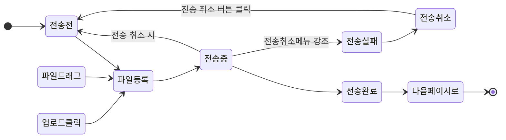
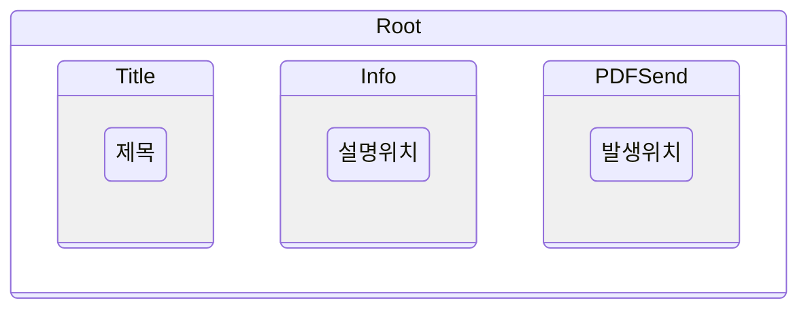
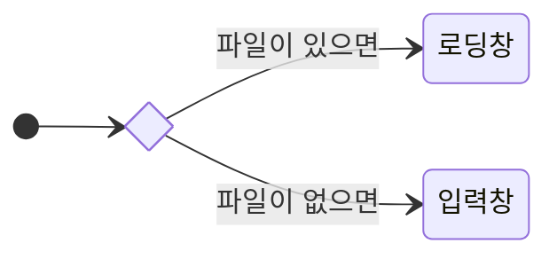

## PDF 전송 컴포넌트 작업하기

구조가 생각보다 복잡해서 자꾸 암기로 하려하는 거랑 꼬여서 이해하는데 시간만 버렸다
구조를 문서화 및 시각화해보기로 했다

### 컴포넌트의 구성

우선 위에서 아래로
상태바 , 안내 메세지 , 작업 컴포넌트가 있고

작업 컴포넌트 내에서 상태가 많이 바뀐다

전송 전 , 드래그 , 파일 등록된 상태, 파일 전송 > 전송은 완료 됬고 서버 응답 기다리는 상태 > ( 실거래가 가져오는 건 스킵 )

이 동작이 PDFSend 에서만 발생한다

그래서 컴포넌트를 한번 더 분리했다
생각보다 수월했다 일단 컴포넌트를 분리하고 필요 없는 부분을 지우고
사용되지 않는 컴포넌트를 다 지웠더니 분리할 수 있었다
꼬여있는 구조를 분해하기보단
골격을 어느정도 다시 만들생각을 하고 과감하게 지웠더니 빨리 됬다

##

파일 등록 시

PDFInputBox (입력창) 컴포넌트가 사라지고
PDFLoadBox(로딩창) 컴포넌트가 생성된다

