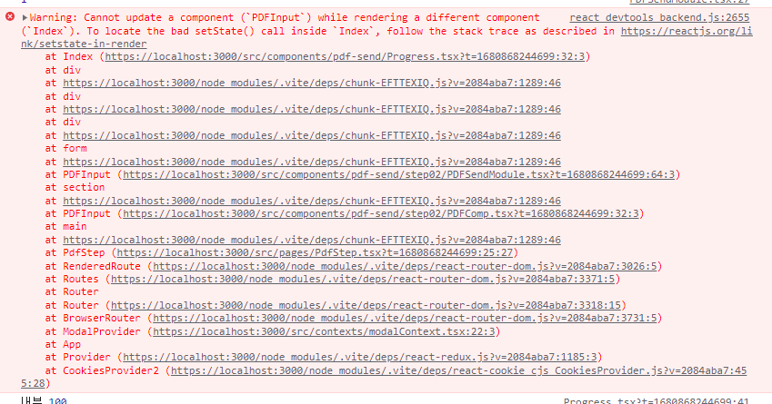

## 해볼만한 연구

테스트 하기 위한 추적가능한 로그를 찍어보고 싶었습니다
파다보니 연구할만해보여서 저장소 따로 파서 경고 구현해보고 없애보겠습니다..! 깔린 프로바이더가 너무 많아서 안될거 같긴하지만..
리액트 쓰로틀링
리액트 디바운스
유효한 트래킹
state 경고 뽑아보기


setstate 가 잦게 발생해서 그런지 위 경고가 발생함

[[react] 쓰로틀링(throttling)과 디바운싱(debouncing)](https://velog.io/@y_jem/%EC%93%B0%EB%A1%9C%ED%8B%80%EB%A7%81throttling%EA%B3%BC-%EB%94%94%EB%B0%94%EC%9A%B4%EC%8B%B1debouncing)

플레이그라운드 만드는게 꽤 빡쌔서 겸사겸사하면 좋아보임

## 오늘 할 일

빠른 마감!

- [x] 호버 인터렉션 ✅ 2023-04-08
- [x] 상단 로딩 바 ✅ 2023-04-08
- [x] 인터샙터로 에러 처리 ✅ 2023-04-08

### 에러

엑시오스 에러로 들어오는 것과 에러처리 형태가 달라질 수 있다
그래서 인스턴스 에러 처리형태를 통일 시키는 것도 괜찮을 것 같음

엑시오스

```
AxiosError
{
  "message": "Network Error",
  "name": "AxiosError",
  "code": "ERR_NETWORK",
}
```

형태가 다른 것을 맞춰주는 인터셉터 처리

```
AxiosError {
	response {
		data {
			code: 403
			message: "PDF 요약본이 없습니다."
			success: false
			data {
				
			
			}
		}
	}
}
```

## drap 이벤트 핸들링 할 때

새로 생성되는 요소에만 `z-index` 를 부여하는게 가능하다

## SVG 제어 좋은 예?

SVG 는 styled 로 다 제어가 안되나..??? 되는 거 같은데...

아 그런데 CSS 로만 넣을 수 있는 속성이 있다 inline 으로 부여하는건 적절하지 않으니 CSS in jS 해서 처리하는 예시로 좋은 것 같다
CSS 에 영향을 받는 부분을 CSS 로 넣어줘서 좋은 예시인 것 같다
그런데 속성의 이름이 조금 겹치기 때문에 주의해야한다..
>예전에 styled svg 했다가 안된적이 있던 것 같은데 ... 잘되서 당황스럽다..

```jsx
import styled from '@emotion/styled';

type Props = {
  fill: string;
  size: string;
};

const CheckIcon = ({ fill, size }: Props) => {
  return (
    <SvgIndex
      width={size}
      height={size}
      viewBox="0 0 36 36"
      fill="none"
      xmlns="http://www.w3.org/2000/svg"
    >
      <path
        d="M34 18C34 9.16344 26.8366 2 18 2C9.16344 2 2 9.16344 2 18C2 26.8366 9.16344 34 18 34C26.8366 34 34 26.8366 34 18Z"
        fill={fill}
      />
      <path
        d="M25 13.5L16 22.5L11 17.5"
        stroke="white"
        strokeWidth="4"
        strokeLinecap="round"
        strokeLinejoin="round"
      />
    </SvgIndex>
  );
};

export default CheckIcon;

const SvgIndex = styled.svg`
  position: relative;
  flex-shrink: 0;
`;
```

## 에러 핸들링 적용

처음에는 인터셉터로 이거를 조절하는 했었는데...
`transformResponse`
경우에 따라서 인터셉터를 거치지 않고 에러를 뱉는 경우가 있는 것을 확인했습니다

그래서 에러핸들링 예제를 적용해서 경우에 따라 에러처리를 하고 문제가 생기면
API 에서 에러를 처리하는 정해진 규칙대로 에러를 반환하도록 하였음
[에러 핸들링 | Axios Docs](https://axios-http.com/kr/docs/handling_errors)

```js
.catch((err) => {
	console.log('err', err);
	if (err.response) {
		// 요청이 전송되었고, 서버는 2xx 외의 상태 코드로 응답했습니다.
		return err.response;
	} else if (err.request) {
		return { data: { success: false, message: `${err.code} : ${err.message}` } };
	} else {
		// 오류가 발생한 요청을 설정하는 동안 문제가 발생했습니다.
		errorMessage(err.message);
	}
	return { data: { code: 200, success: false, message: '파일 전송 실패' } };
});
```

## tab 선택 시 css

포커스 될 때 색상 변하는 것 때문에 버튼을 선택했다가 드래그해서 놓는 걸로 했을 때
배경색이 좀 이상해지는게 눈에 띄었다

그래서 찾아봤고 focus 속성에 의한 것을 확인함
그런데 포커스에 속성이 하나 더 있는 것 같았음 탭을 했을 때 조금 형태가 달랐다 > 이건 hover 랑 focus 를 하나의 css 로 제어해서 발생했다

focus 의 영향을 받는 하위 스타일로 focus-visible 이 있었음
> 포커스쪽 스타일을 베이스로 깔고 추가 설정이 가능한 스타일 ( focus-visible 의 기본 값보다 focus 의 설정 값을 우선함 )

그래서 아래 옵션들을 제어함

```css
&:disabled {
    background: ${COLORS.Disable};
    span {
      color: ${COLORS.Font_grey_03};
    }
  }
  &:hover {
    background: #6c7de0;
  }
  &:focus {
    border-style: none;
    outline: 2px dashed ${COLORS.MainBG};
  }
  &:focus-visible {
    outline-offset: 4px;
    outline: 3px dashed ${COLORS.Font_BL};
  }
  &:active {
    background: #283ebd;
  }
```

## styled 스타일 모듈화하기

reset 적용하는 방식을 보니 저런게 아주 어려운 기능은 아닐거같았음
실제로 그냥 템플릿 리터럴 객체 ( `\n` 처리를 자동으로 해줘서 씀 )
에 넣어서해도 되고 아래 예시처럼 쓴다음

```ts
export const mainLargeButton = css`
  display: flex;
  flex-direction: row;
  justify-content: center;
  align-items: center;
  `;
```

아래 예시 처럼 적용하면 적용되더라 꽤 유용했다

```ts
const NextButton = styled.button`
  ${mainLargeButton}
`;

```

그럼 `const = css~` 에 css 파일에 있는 걸 넣는 건 가능하려나 궁금해진다

이 방식이 좋은 이유는 story book 같은 것에서 버튼들의 모든 간격을 조절할 때 값을 전체 공유할 수 있다
