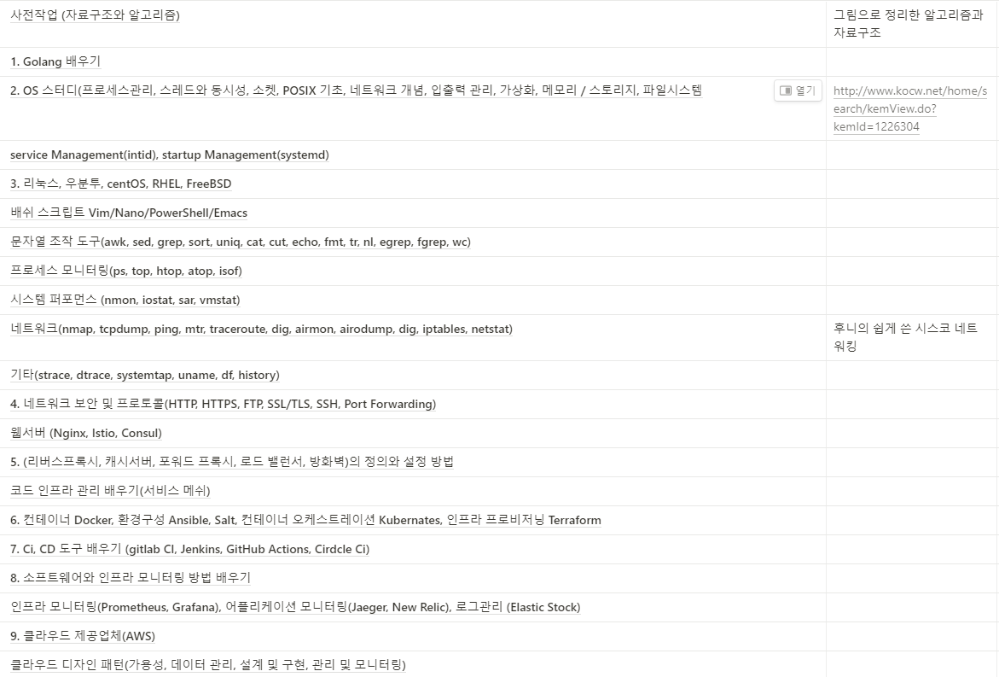

## URI

파일 시스템에 접근하는 URI  
`file://C:` 를 하면 확인할 수 있다

초기에 db 파일을 연결하는 것을 하는데 이때 파일 URI 를 볼 수 있었다  
그리고 이게 상대경로로도 되서 좀 신기했던 부분  
[미친 라이브러리가 나타났다 💥 - YouTube](https://www.youtube.com/watch?v=DlyoFFOcPCg)

## 데브옵스 관심 있어 하는 다른 사람의 질문

도커랑 쉘스크립트를 우선으로 한번 공부해봐라!

자료구조와 알고리즘 (하나도 관련 없음)

1. golang (관련은 있지만 입문시 큰 상관은 없음)
2. os 스터디 (개념이라 알아서 나쁠 건 없지만 굳이 깊게 배울 필요 없음)
3. freebsd (절대 여기 배포할 일 없음), rhel centos (대부분 데비안 - 우분투 계열만 알아도 충분. rhel 계열은 일단 눈에 띄는 차이점은 패키지 설치 정도이니 그건 배우시되 깊은 차이는 미리 배우실 필요 없고 나중에 그때귿태 검색해서 배우세요. rhel 문서 잘되어있어요)  
    Vim/nano/powershell/emacs (넷다 배울필요 없고 안씁니다. 파워쉘은 윈도우 서버에 배포할때 외에는 거의? 이맥스는 그냥 배울 필요가 하나도 없어요 얘는 심지어 gui 에디터)  
    awk, sed(간단한것만 익히시면 충분한데 깊게 배우실필요 없어요. awk 빼고 sed substitution 만 배우세요)  
    strace, dtrace, systemtap(입문 수준에 굳이 필요 없고 배포에 큰관련 없음)  
    atop, nmon, sar, vmstat (실제로 별로 안 씀. 배우셔도 상관은 없지만)  
    nmap, tcpdump, mtr, airmon, airodump (나중에 배우셔도 되지만 입문 수준에서 불필요. 그리고 dig 중복되어있어요)  
    ftp (알아도 되지만 실무에선 80% scp 로 끝납니다. 정 아니면 sshfs 로 마운트할수도 있고..)
4. istio, consul(nginx 가 압도적으로 많이 쓰임)  
    포워드 프록시 (개념만 말하신 거면 상관없지만 mitm proxy 같은 걸 말하신 거면 굳이 필요할까 싶습니다.)
5. ansible, salt (내용의 방대함에 비해 아주 많이 쓰는 건 아님. 레시피 기본 정도만 알아도 충분하실 겁니다) 쿠버네티스 (아주 중요사긴 한데 이것 하나만 별도로 책 몇권이 필요할 정도로 방대하기 때문에 천천히 배워 보세요. 도커 바로 배운 직후 → 쿠버 요렇거보단 충분히 익숙해지신 후 공부해 보세요. 안그러면 초보자들이 도커랑 쿠버 개념을 혼동하는 일이 많습니다.)
6. jenkins, circleci (젠킨스는 많이 쓰긴 하지만 현재는 보통 GHA 면 충분, circleci 는 좋지만 나머지에 비해 별로 안 씀)  
    jaeger 랑 new relic 중 하나만 배우셔도 충분 (전 jaeger 를 추천드립니다)
