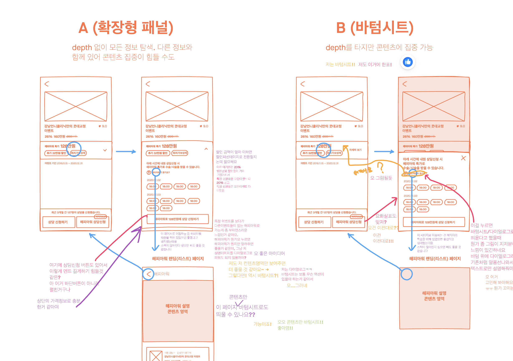
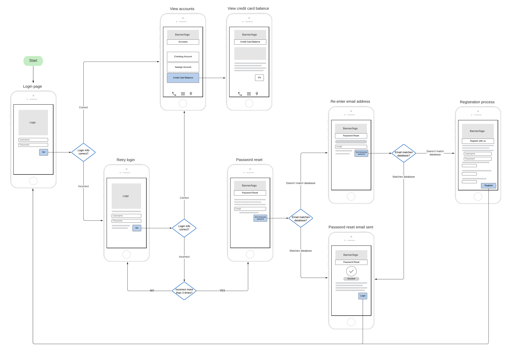

#파이널프로젝트회고록

## 소개

구현할 기능에 대한 정의와 기능이 발생시키는 결과
구현이 결과를 발생시키는 과정과

구현과정에서 유저와 접점이 생기는 구간을 표시하여
접점 구간들에 대한 디자인을 전부 요청하는 것이 좋다

시각적으로 어느 시점에서 어느 분기가 발생하는지에 대한
순서가 제공되는 것이 더 좋다

### 예시

> [!NOTE] PDF 드래그 드롭에서 PDF 드롭할 때의 인터렉션 디자인
드래그해서 브라우저 위에 있을 때
드래그해서 업로드 버튼 위에 있을 때
드롭 하였을 때
전송과정에서 로딩 인터페이스
실패시 가이드 인터페이스
성공시 액션
전송 완료 시

## 디자인 시스템에 대한 구체적인 구조

저는 디자인 시스템을

디자인 원칙과 개발 프로세스가 서로 호환되는
효과적인 개발 자원 관리 시스템을 구축한 것이라고 생각합니다

> 디자인 원칙 잘 설명된 자료 : [조형의 요소와 원리 intro](https://story.pxd.co.kr/192)
> 개발 프로세스 : 아토믹 디자인 , 객체 지향 SOLID

버튼 등의 UI 를 재사용할 수 있는 디자인 구조를 만드는 것
또는 다양한 종류가 필요하더라도 그 패턴이 정형화된 구조 내에서 일어나도록 할 것
객체 지향 설계에 따라 만들어진 디자인 내에서 의존성을 주입할 수 있도록 하는것

동일한 폰트 사용
동일한 컬러 사용
동일한 간격 사용으로 통일성을 맞추는 것

버튼 안에 폰트 크기도 같은 목적으로 사용하고 같은 디자인이라면 동일한 디자인이여야 통일성이 있을 것이다

기능을 구현 기획할 때

등기부등본에서 설명이 필요한 단어가 필요하다 라고만 하고
어떤식으로 표현할지에 대한 것을 확정하지 않았기 때문에 기획이 나올 때까지
기다려야하는 문제가 있었다

## 구성안 확정하기

조사 > 기획 > 구체화 > 와이어프레임 설계 > 프로토타입 제작 > 검토 > 통합 > 개발 > 배포
등의 프로세스에서

프론트엔드에게 와이어프레임에 대한 구체적인 작업은 명세화된 기능을 화면 단위로 분배하는 작업이다
기획이나 디자인의 와이어프레임 설계는 UI 의 배치나 흐름도 작성에 사용되는 와이어프레임이기 때문에
그 의미가 서로 미스매칭 될 수 있다

고로
즉 디자이너나 기획, 백앤드 등 전체와 회의할 때 우선적으로 요구하게 되는 와이어프레임은
명세화된 기능을 화면단위로 분배한 와이어 프레임이 될 것이다

[강남언니-나의 대충 그려졌고 소중한 와이어프레임](https://blog.gangnamunni.com/post/communication-with-wireframe/)

디자이너 기획이 생각하는 와이어 프레임

프론트엔드가 생각하는 와이어 프레임

이 부분을 잘 전달 해야한다
사실 양쪽이 복합적으로 녹아든 것이 최종 와이어 프레임이지만 나눠지게 된다면 저런식으로 나눠진다

기획 이후 구성안을 확정 시키는 것이 나오는게 순서에 맞다
순서랑 위치는 바뀌어도 되니까 무엇이 들어가야할지 정하는 것!

### 적용하기

디자인과 기획이 같이 진행되거나 요구사항이 확실히 명시적으로 작성되고 픽스되지 않는 문제가 있었다

이미 정의된 기능들을 다시 기획하며 요구사항 정의를 덧 씌우하면서,
디자인이 같이 진행되고 와이어프레임이 프로젝트 완료되야하는 일정을 10 일 남기고도 나오지 않아서 고생했었다

분석하기로 UIUX , 백엔드 , 프론트엔드간 일정을 분배하고 조율하는 PM 역할을 수행하는 리더가 없었고

## 데이터의 출처와 권한이 다름을 알려줘야한다

이 기능은 이 데이터가 필요한데
이 데이터는 소유자가 달라서 접속을 허용하지 않는다

이쪽 용어를 써주는 게 좋다
개발자들 한테는 이미지가 > 픽토그램이고 아이콘이고 그림이고 사진인데
도표는 다이어그램, 노드 , 막대형, 표준 분포도..

디자이너한테는 픽토그램은 개념적으로 정의된 것에서 상징적 의미를 가진 이미지
아이콘은 특징을 간략화한 것
그림은 손그림
사진은 카메라로 찍은 것
도표 = 도표, 막대그래프 , 선그래프, 점 그래프

## 오해 가능성을 줄이는 작업을 해야한다

이건 해결 하기 어려운 일이다
아닌 것을 확실히 하는게 좋을 것 같다

사진이 아니였다
그림도 아니였고
건물의 상황을 반영한 실사 그래픽도 아니였어

**그냥 전용면적이란 단어자체를 뜻하는 픽토그램이 필요했다** < 이런 축약된 말과 함께

일단은 오해할 수 없도록 설명하는 것의 특징 나열

1. 실제 건물의 정보와 전혀 달라도 된다
2. 전용면적과 공급 면적의 차이를 사용자한테 인지시키기 위해 넣을 것이다
3. 건물마다 이미지가 달라지지 않아도 된다

### 미스매칭 예시

#### 내가 요청한 것

전용면적임을 알 수 있는 상징적이미지

#### 디자이너가 이해한 것

아파트 별 전용 면적 표시 이미지
