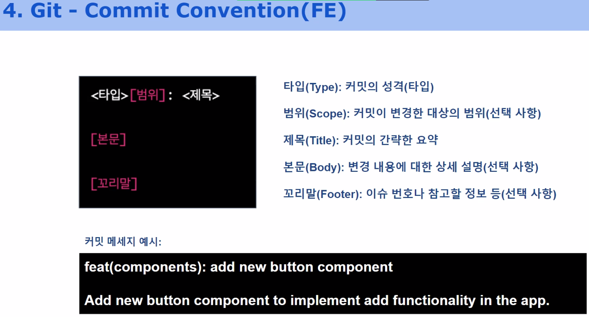

사전 설계 할 수 있는 내용들
운영에 대한 설계를 포함한다

## github 설계

### 브랜치 전략

나는 개인적으로 유지관리가 필요한 프로젝트에는 git flow
짧게 해야하는 것은 github flow 에 deploy 만 추가하는 것이 좋다고 생각한다

### 커밋 컨벤션

### 이슈 컨벤션

prefix : 이름

작업 현황

### 변수 네이밍 컨벤션

### 풀리퀘스트 컨벤션

prefix : 이름 이슈넘버
작업 내역
변경 사항
작업 단위 구분 및 관리 ( 이유에서 부터 진행되는 편 )

#### PR 리뷰에 대한 구조

깃 hub 풀 리퀘스트 리뷰를 git action 으로 넣을 수 있다?

### 마일스톤 관리 및 공유

스프린트 단위, 주제 단위 , 기능 단위 등

### 프로젝트 테이블 관리

## 기획, 디자인 공유

기획은 디자인에 녹아나고 디자인 구성은 이슈에 녹아나는 것이 좋다

빠른 회의를 위해 사전 취합, 잘 될 수 있도록 CI/CD 구축

> 개발 주기에 따라 디자인이나 기획이 먼저 끝나는것은 필연이라 생각함

### 디자인 시스템

폰트 사이즈 , 공통 UI 테마

### 비즈니스 로직과 UI 로직

### 기획과의 연결

## 개발 시스템 관리

### 개발 환경

#### 주요 라이브러리

사용하는 이유

### 어플리케이션의 서빙 구조 시각화

### 자동화 구조

### 에러처리 , 이슈 처리 전략
