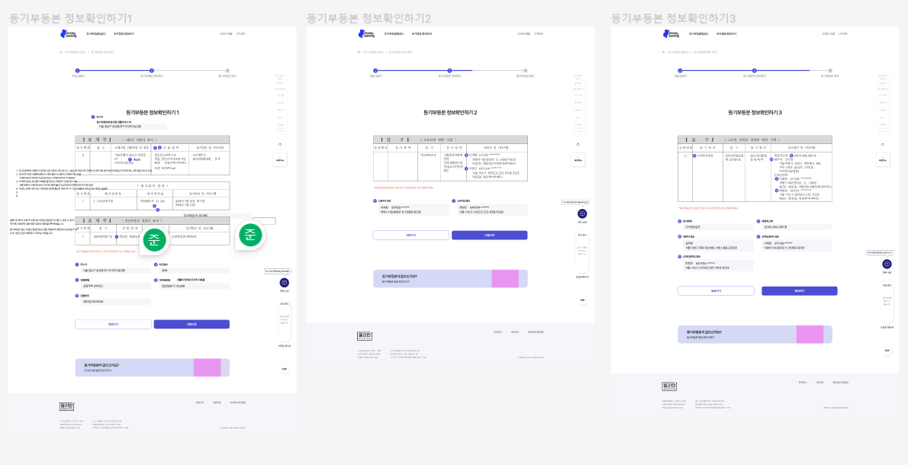
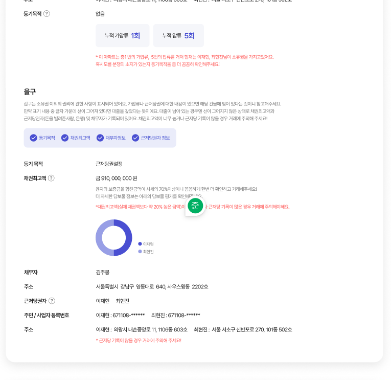

## 소개

기획 디자인 시안이 나오고
백엔드에서 데이터 명세서가 나온 상황

디자인과 벡엔드 명세서를 대조하여 구현 여부를 파악해야하는 상황이였다
데이터의 구조와 제공해야하는 서비스가 서로 잘 맞지 않아서 수정을 진행함

로직상 페이지의 역할이 분명하게 명시되어있지 않지만
구조적으로 해당 페이지는 입력된 데이터에 대한 검토 인 것을 전재함

1. 표시될 PDF 와 사용자가 입력한 것은 매칭이 되지 않는다
   - 샘플 데이터화 하고 위치만 안내하도록 하며 3 번의 목적을 지키도록 하는 것이 좋을 것으로 보임
2. OCR 하지 않기 때문에 정확도는 많이 올라간 상황이여서 PDF 에 데이터의 위치를 표시할 수 없고
   백엔드 로직 에서도 PDF 의 텍스트를 그대로 파싱한 데이터가 넘어오지 않고 내용을 정리, 요약한 데이터가 넘어온다
3. 해당 페이지는 요약에 필요한 정보들이 제대로 왔는지 확인하기 위한 용도이며,
사용자에게는 어떤 방식으로 이러한 데이터들이 수집되었는지 확인하게 하기 위한 절차
   
- ( 수정을 위해서는 복잡한 규칙성을 사용자가 지켜주거나 그런 가이드라인을 제공해야하기 때문에 생략 )
4. 현재 백엔드 상에서 넘어오는 데이터와 요약에 필요한 데이터가 다 다르기 때문에 일치시키는 작업이 필요함
5. 호수의 구분 방식이 일정하지 않으므로 하나의 건물에서 동 , 호수 구분이 필요하다 ( 호수 구분은 필요함 )
   - 층 호 구분 가능한 데이터가 필요함

### 담당자

샘플 데이터의 정보가 사용자로 하여금 혼동을 야기할 수 있을 것 같아
제거하고 번호와 내용 제목 정도만 적어놓도록 하겠습니다.
등기부등본 정보 수정은 현실적으로 힘든 부분이라 판단되어 안내문구 및
수정 기능은 일단 배제하고 마크업 하겠습니다.

## 소통 과정

일단 공문처럼 오픈된 곳에 문제 제기 후 답변 받았다
일단 써보고 이야기하기로 했다
이 배포환경이 https 여서 위에 빌드 단위별 config 조절 을 찾게 된 것이기도 함 [T2023-03-31](../../../topic/tech-review/T2023-03-31/T2023-03-31)

> 노드 백엔드는 그게 안되는데 내 테스트를 위해서 node 백엔드 로컬의 https 설정 솔루션도 찾아야겠다는 생각이 듦

> 결과가 또 원하는 구조랑 달라서 다시 api 확인된 것에 맞추는 작업이 진행됬음

합의되지 않은 기능이 추가되면서 추가로 설명도 없었어서 개발에 어려움이 있었음

### 해결 방안

입력 값과 출력 값
입력값에 의한 출력형태 변경 예상 범위
출력 값의 타입을 미리 설정하는 것이 좋을 것 같음
