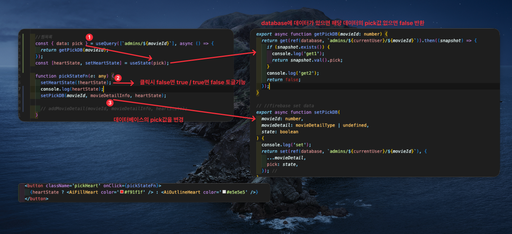

다른 분이 작업하려고 질문하신건데
이런 작성 방식 자체가 마음에 들어서 가져왔다

그러니까... 이런 것을 작성할 수 있는 적합한 플랫폼을 고민해봤다

## 내가 생각 한 기능

내가 찾던거는
자동으로 1 , 2 , 3 같은 넘버링과 컬러 구분을 부여해주고
자유롭게 텍스트를 추가할 수 있는 것이였음

### 생각하겓 된 이유

## 기존 플랫폼 분석

다이어그램 io 도 나쁘지 않은듯
플러그인을 만들 수 있을 지가 중요할 듯

### 피그잼

간단하게 테스트와 서치를 해봤다
피그마로 재밌는 클래스 다이어그램 그리는 도구 몃개나 찾고 끝났다 > 위젯에 재밌는게 조금 있네

원하는 카운팅이 들어간 기능을 찾을 순 없었다

플러그인이나 위젯으로 만들 가능성이 존재하긴 한다

### draw.io

플러그인으로 열 수 있고 ... 때문에 좀 더 가치 있어보인다
[List of diagrams.net plugins](https://www.diagrams.net/doc/faq/plugins)

## 피그잼

피그마 내장으로 사각형을 넣을 수 있어서 내가 원하는 기능이 모두 구현된다
순서를 넣어야할 상황이 있으면 내용에 번호를 추가해서 표시할 수 있음

그리고 커멘드의 작성자가 구분되기 때문에 더 유용한 것

`#` 은 순서대로 나오긴 하는데 , 삭제된 것도 포함되서 나온다
디폴트는 있는 것에서 넘버링되는데 조금 시간 지나면 수정된다

