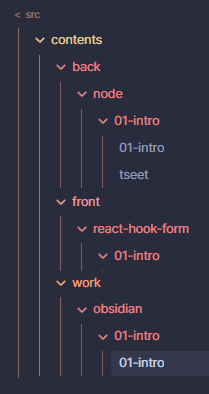

## 장점 소개

1. 기본 시스템 설정으로 md 파일만 볼 수 있게 세팅하고 folder focus 기능이 있는 플러그인을 설치해서 contents 영역만 제어할 수 있게 하였음
   

2. src 외부에 .obsidian 을 둠으로써 컴파일 되지 않게 함
3. 기획 문서를 작성할 때, 개발환경과 격리된 듯 한 기분이 들어서 잘 된다
4. root 경로가 git 과 같아서 git repo 에서 md 파일을 열어서 문서 내에서 링크를 따라갔을 때 링크가 따라가진다
5. md 파일 툴이라 작성이 편함 , 표, 머메이드 등등
6. 기존 메모 시스템과 분리할 수 있다
7. 코딩을 하면서 메모를 해야하는데,
   기존 파일에서 프로젝트용 메모를 프로젝트 파일에 적는 것에 대해서 정리하기 애매한 부분이 있었다
   이런 부분을 해결 > 확실히 분리함으로써 불확실성에 대한 배제를 할 수 있었음

## 세팅하기

다른 것들은 취향 껏 설치하면 되는데
파일 링크는 상대 경로 최단거리로 설정한다
우선 vscode 와 호환되는 유일한 형식이기도 하고 이걸로 해야 나중에 자동화 하기 좋다

- [ ] 상대경로를 배포 호환 링크로 변경 자동화
