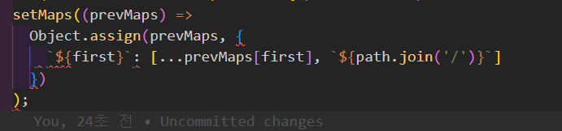
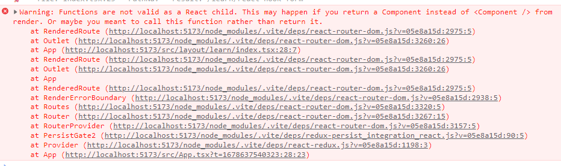
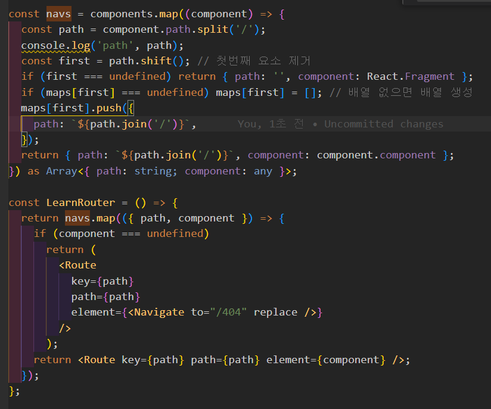

[리액트에서 폴더 구조대로 라우팅하기 (feat. Vite) | keencho's blog](https://keencho.github.io/posts/react-vite-routing/)

잘 가져와진다

```tsx
const modules = import.meta.glob(
  ['../contents/front/**/*.tsx', '../contents/back/**/*.tsx'],
  { eager: true }
);
console.log('modules', modules); // 가져오기
```

배열로 여러가지를 넣어서 가져오게 하는것도 되긴 하는데
결과값에서 하나의 배열로 오기 때문에 크게 의미는 없다

제외할 옵션을 넣을 수 있다는 것에는 의미가 있는 것 같다

> 이미 위 동작에서 경로의 파일을 import 한 상태라고 볼 수 있다
> 그래서 파일 이름을 어떻게 바꾸든 크게 상관은 없다 단지 원본의 값이 회손될 뿐임

[지원하는 기능들 | Vite](https://vitejs-kr.github.io/guide/features.html#glob-import)

이 기능을 실행함으로써
src 에 모듈들을 객체에 임포트한 상태가 된 것임

아래 동작을 수행해서 쓸 때 없는 영역은 날려서 path 로 만들고

```tsx
const components = Object.keys(modules).map((component) => {
  const path = component
    .replace(/\.tsx$/g, '')
    .replace(/^\.\.\/contents\//g, '');
  console.log('path', path);

  return { path, component: modules[component].default };
});
console.log('components', components);
```

## 애먹은 객체 state 업데이트

이런 형태의 state 를 업데이트 하려 했다

```json
{
  "front": ["14535/144", "124adf/afdsf"],
  "back": ["14535/144", "124adf/afdsf"]
}
```

실패한 형태

### object dynamoc property


를 [] 로 감싸세요 연산쓰려면 [] 감싸야해요
키는 symbol 이랑 string 만 되고 연산쓰려면 [] 감싸야해요

성공한 형태

```tsx
setMaps((prevMaps) => {
  const newMaps = { ...prevMaps };
  const tt = first;
  newMaps[tt] = [...prevMaps[tt], `${path.join('/')}`];
  return newMaps;
});
```

원래 2 중 베열 객체였는데 간소화 한 거임
원래 아래 같은 느낌이였음

```json
{
  "front": [{ "path": "14535/144" }, { "path": "124adf/afdsf" }],
  "back": [{ "path": "14535/144" }, { "path": "124adf/afdsf" }]
}
```

## 에러


이런 에러가 발생해서 기존 코드를 App.tsx 에 컴포넌트 인라인으로 수정하려해봤다

시도했을 때의 가장 큰 문제는
해당 컴포넌트에서 vite 가 제대로 실행되지 않는다는 것

## 해결 완료

이것저것 확인하다보니 그나마 잘 되는 것 조차 내용은 불러오지 못하고 있었다

그래서 코드를 살펴보니 성공한 코드에서 컴포넌트 객체가 소문자라는 것을 정말 불현듯 깨달았다

```tsx
  return { path: `${path.join('/')}`, component: component.component };
}) as Array<{ path: string; component: any }>;

element={component}
```

그래서 해당 코드들을 전부 대문자로 바꾸니 해결됬다

지금 보면 as 로 map 에서만 바꿔도 될 거 같다

```tsx
  return { path: `${path.join('/')}`, Component: component.component };
}) as Array<{ path: string; Component: any }>;
return <Route key={path} path={path} element={<Component />} />;
```

해봤더니 된다

```tsx
{
  navs.map(({ path, component: Component }) => {
    if (Component === undefined)
      return (
        <Route
          key={path}
          path={path}
          element={<Navigate to="/404" replace />}
        />
      );
    return <Route key={path} path={path} element={<Component />} />;
  });
}
```

JSX 문법을 잘 지키자 라는 것을 알 수 있었다

## 리액트 컴포넌트 함수 사용하기

{LearnRouter()} 이런식으로 사용함 그런데 굳이 이름 대문자일 필요 없다
JSX 문법으로 쓰는게 아니여서 무방함


