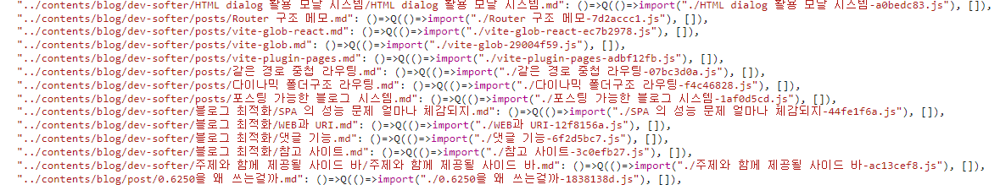

열심히 glob 로 만들어놨더니
플러그인이 있다고 한다
[GitHub - hannoeru/vite-plugin-pages: File system based route generator for ⚡️Vite](https://github.com/hannoeru/vite-plugin-pages)

플러그인들은 [플러그인 API | Vite](https://vitejs-kr.github.io/guide/api-plugin.html)
이 경로에서 볼 수 있따
리스트는
[GitHub - vitejs/awesome-vite: ⚡️ A curated list of awesome things related to Vite.js](https://github.com/vitejs/awesome-vite#plugins)

왜 찾게 됬냐면 빌드 과정에서 파일을 가져오는게 안되서 찾게 되었음

로컬에서도 안되더라
그래서 플러그인을 찾게 됬는데
[GitHub - y-nk/vite-plugin-remark-rehype: a vite plugin to setup remark/rehype pipeline](https://github.com/y-nk/vite-plugin-remark-rehype)

있긴 있다
[vite-plugin-remark-rehype - npm](https://www.npmjs.com/package/vite-plugin-remark-rehype)

잘 적용되서 빌드가 되게 되었고
구조를 보아하니 md 파일을 js 으로 만들어서 저장했기 때문에, 한 페이지에서 포스팅한 것도 올릴 수 있게 됬다.. ㄷㄷ

> 조작되는 설정을 잘 까보면 좀 더 낮은 의존성으로 md 파일을 읽게 할 수 있지 않을까 싶다

## How to use

```ts
import { defineConfig } from 'vite';
import remarkRehypePlugin from 'vite-plugin-remark-rehype';

export default defineConfig({
  plugins: [remarkRehypePlugin()],
});
```

## Adding type support

In your tsconfig.json

```ts
{
  "compilerOptions": {
    "types": ["vite-plugin-remark-rehype/types"]
  }
}

```

Or you can add a .d.ts file in your project root containing

> 둘 중 하나만 하면 된다

```ts
declare module '*.md' {
  const html: string;
  export default html;
}
```

## 번들링 된 코드에서 변환된 코드들을 볼 수 있었다

이걸 통해서 vite glob 를 통해서 변환될 때 값도 저장되는 것을 추정할 수 있었다



`import` 목적으로 사용하지 않앗으나
사용하고자 한다면 위 링크처럼 된 변환식으로 호출한 js 데이터를 사용한다는 것으로 예측해볼 수 있었다
그 이후는 플러그인 번들링 되기 전 소스를 보면 좀 도움이 된다

사용하기엔 적합하지 않다
데이터를 JS 로 바꿔서 관리한다는 문제

일단 객체에서 한번에 관리되기도 해서 로딩도 길어진다
